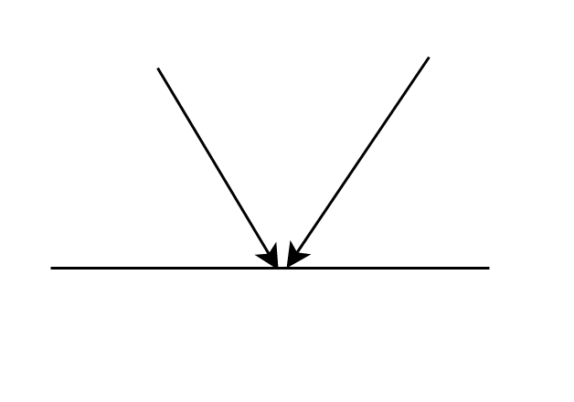
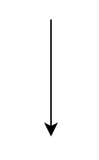
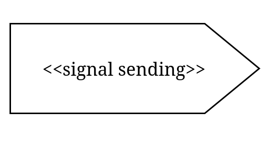
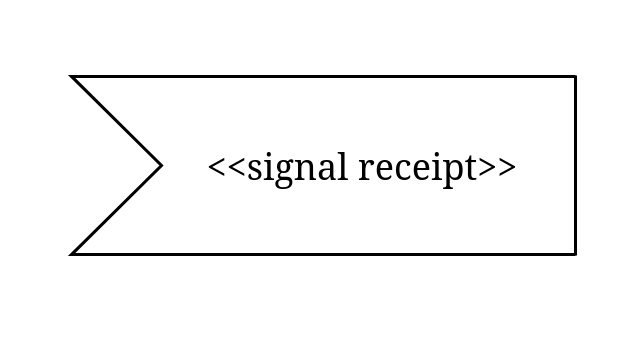
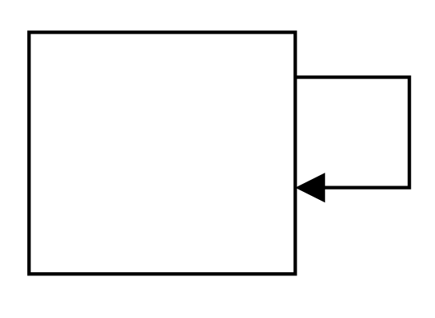
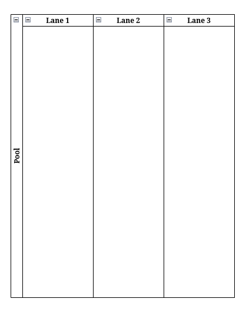
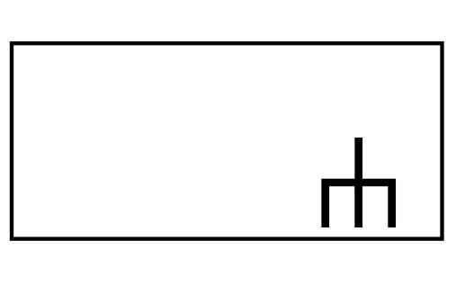

### Diagrama de atividades

-   complementar ao caso de uso
-   não precisa ser usado em todos os casos de uso
-   usado geralmente em casos de uso muito complexos
-   representação similar a um fluxograma
-   representa um fluxo de interação de um cenário
-   não identifica os atores, mas através de raias (divisões verticais,
    ou colunas) podemos criar repartições que separação as ações por:
    tipo, ator, área, etc.

### Ponto de divisão/intercalação

-   o ponto de divisão é usado para criar fluxos alternativos (se
    assemelha a um comando if).
-   pode também ser usado com o intercalação, ou seja, juntar dois
    fluxos que foram separados antes pelo if

### Ação

-   representa a ação que o ator vai fazer

### Nó inicial

-   representa o começo do fluxo

### Nó final

-   representa o fim de um fluxo
-   podem haver mais de um

### Separação

-   separa o fluxo em dois que serão executados em paralelo

### Junção

-   une dois fluxos paralelos
-   sincroniza as ações

### Fluxo

-   Indica o fluxo

### Tempo

-   indica prazo/tempo/período

### Envio de dados

-   indica o envio de informações/sinais

### Recepção de dados

-   recebe os dados enviados

### Loop

### Raias

-   divide o diagrama em áreas

### Abstração

-   você pode abstrair casos para outros diagramas e referenciar eles no
    diagrama principal usando esse símbolo com o nome do outro diagrama
    nele

