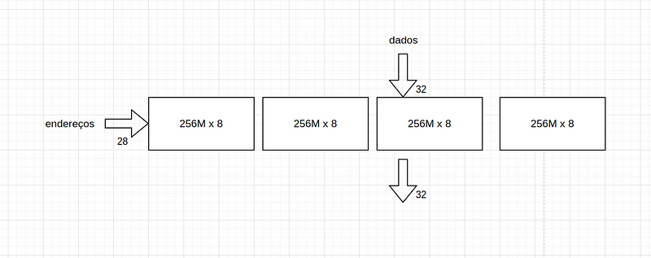
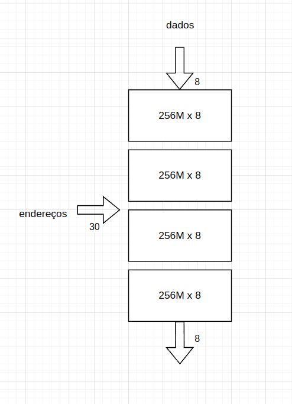

Dentro das memórias do computador (memória RAM), podemos ter vários
tipos de interligação de bancos de memórias para alcançarmos o tamanho
desejado.

Mais precisamente, há dois formatos de ligação, série e paralelo.

A ligação em paralelo, aumenta o tamanho de bits que uma palavra pode
ter, mas mantem a quantidade de palavras que a memória pode suportar
(aumenta o barramento de dados e não o de endereços).

Já a ligação em série age de forma inversa, aumentando a quantidade de
palavras que uma memória pode suportar, mas mantendo o tamanho dessas
palavras.

Nesse exemplo, temos uma memória de *256M x 8bits,* sendo 8 bits para o
barramento de dados e 28 bits (2⁸ = 256, e 2²⁰ = 1M) para o barramento
de endereços.

Para aumentar o tamanho da palavra para 32 bits, poderíamos fazer:

sendo agora uma memória de 256M x 32bits.

Além disso, poderíamos ter aumentado o tamanho da memória da seguinte
maneira, fazendo:

Com a associação em série de quatro componentes de 256M x 8 bits, temos:
4 \* 256M = 2\*\*2 \* 2\*\*8 = 2\*\*10 \* 2\*\*20 = 2\*\*30 = 1G, sendo
assim um G de memória com 8bits cada palavra.

Poderíamos também, unir esses dois componentes fazendo uma memória ainda
maior:

dessa forma temos uma Memoria de 1G x 32bits.

