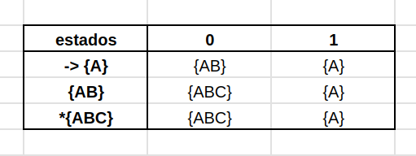

Para minimizar o nosso AFND, podemos fazer a conversão dele para um AFD.
Para isso faça:

1.  liste todas as transições que um estado faz para outro como um
    conjunto único, em seguida use esse conjunto como sendo o próximo
    estado a ser observado na tabela:

você para de testar novas combinações quando nenhuma combinação nova
aparece como transição. Além disso, todo conjunto que tiver um estado
final, também sera considerado um estado final (\*).

Também, se houver uma parte desconexa com o automato principal, você
pode desconsiderá-lo na conversão.

2\. dê nomes as transições: Agora, você pega essas transições que foram
descobertas e de nomes diferentes à elas (aliases).

3\. pronto, podemos pegar essa tabela e fazer um AFD

