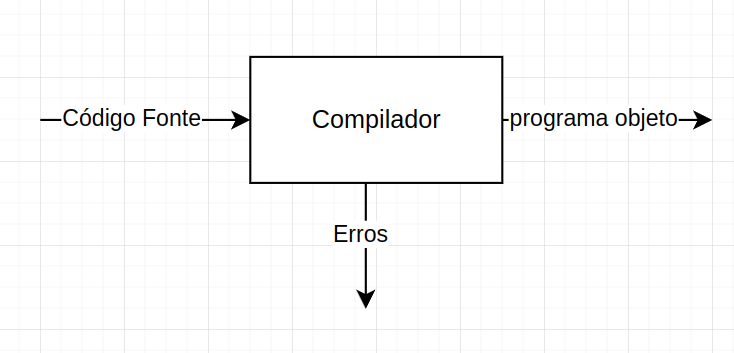

#### Script(interpretado)

Em linguagens de script, os comados são interpretados e executados linha
a linha pelo interpretador.

#### Compilação

Todo o código é escrito e depois o compilador procura por erros e traduz
os comandos para linguagem de máquina.




### Partes do compilador

#### Análise

Na parte da análise, o compilador verifica se o código está
sintaticamente e semanticamente correto, caso negativo os erros são
mostrados para o usuário.

Além disso, aqui é criado uma representação intermediária do programa em
formato de árvore, assim como uma tabela com os símbolos usados.

#### Síntese

Aqui o programa objeto em si é construído a partir da estrutura
intermediária gerada na análise.


#### Estrutura do compilador


#### Analisador léxico

Aqui cada linha do programa é quebrada em 'tokens' (partes da linha de
fazem sentido estarem juntas por si só) e atribui valores para elas
dando significado.

*Obs: cada parte é chamada de lexema, e o lexema com os valores (como
uma hashtable chave-valor) é chamado de token.*

``` {code-block-mode="2" spellcheck="false" code-block-lang="markdown"}
# exemplo

if a > b: 

<id-1, if, palavra-reservada>
<id-2, a, variavel, inteiro>
<id-3, b, variavel, inteiro>
<id-4, >, comparador>
<id-5, :, stop-symbol>


## alem disso aqui é gerado a tabela com esses elementos (tabela de simbolos)


|  id  |  symbol  |  type  |  function  | value |
|------|----------|--------|------------|-------|
|  1   |   if     |   -    | reservado  |   -   |
|  2   |    a     |  int   |  variavel  |  10   |
|  3   |    b     |  int   |  variavel  |  30   |
|  4   |    >     |   -    | comparador |   -   |
|  5   |    :     |   -    |  stop      |   -   |
```

Esse formato é interessante, pois poderíamos pensar nisso como um
automato também. Sendo assim poderíamos pegar e criar um autômato para
reconhecer cada token separadamente.

*OBS: lembre-se que os lexemas não são necessariamente separados por
espaço, poderíamos repensar no exemplo como: "if(a\>b):"*

#### Analisador sintático

Com ele, pegamos os tokens, e criamos uma representação em formato de
árvore. Cada Nó pai é uma operação e os filhos os argumentos ou
operandos.


#### Analisador Semântico

Aqui ele verifica por incongruências no código, como variáveis não
declaradas, variáveis de tipos diferentes em comparações, etc.

Além disso, se necessário ele pode fazer conversões simples, como int to
float.

#### Gerador de código intermediário

Aqui a árvore é convertida em um código com a sequencia de execução.

Não é necessariamente assembly, mas se aproxima de como será a estrutura
do assembly final.

#### Otimização

Aqui é feita toda e qualquer otimização possível no código intermediário
para reduzir ciclos necessários.

Essa parte pode, em alguns casos, estar junto com a geração do código
intermediário.


#### Notas

-   Função INPUT é bloqueante, uma vez que precisa de fazer várias
    operações no hardware e esperar por elas
-   para guardar valores com o sinal, o bit mais significativo é
    reservado para o sinal, sendo 1 para '-' e 0 para '+'
-   Para guardar floats uma parte dos bits (parte mais significativa)
    guarda os números, e a parte menos significativa para guardar as
    casas decimais. Com isso, para operações basta ter dois números
    nesse formato, fazer a operação com a parte mais significativa e
    ajustar as casas decimais


