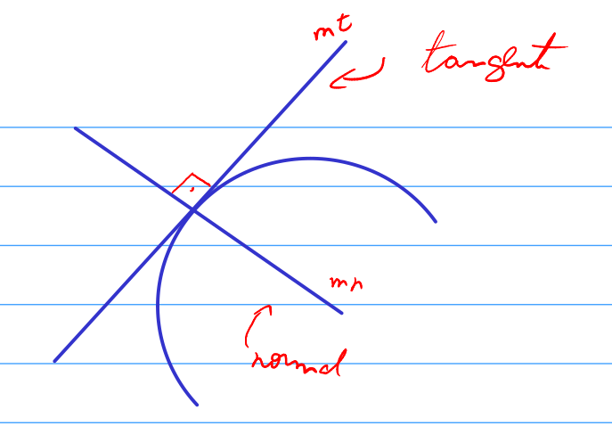

a reta normal é uma reta que faz 90° com a tangente.

é possível ver que a reta normal e tangente são inversas e opostas uma a
outra.sendo assim, o fato m das retas segue a relação:

Com isso, podemos encontrar a equação da reta usando os dados da reta
tangente e essa relação.

Retas paralelas significa que possuem a mesma inclinação m.

