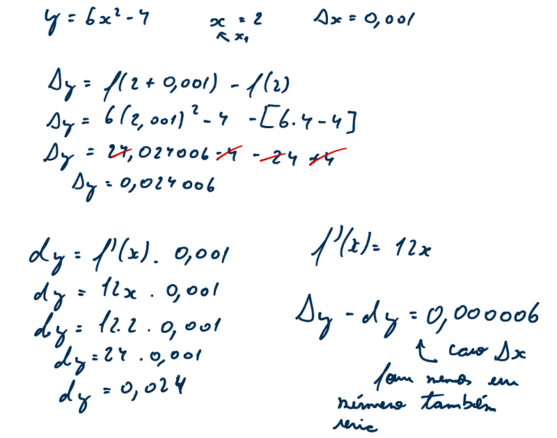

#### Acréscimo

O acréscimo pode ser visto o quanto x varia e o quanto y varia em um
certo intervalo. Sendo assim Δx e Δy são os acréscimos em x e y
respectivamente.

#### Diferencial

O diferencial pode ser visto então como a relação entre o acréscimos.

Podemos ver também que ao correlacionar os diferenciais, encontramos a
notação de Leibniz para derivadas.

Com o diferencial podemos aproximar raízes:

#### Notas

arc tg x → qual o arco em que a tangente da x

