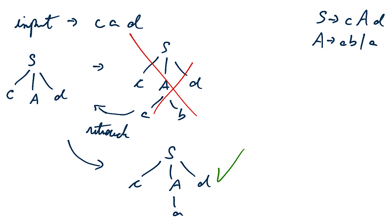
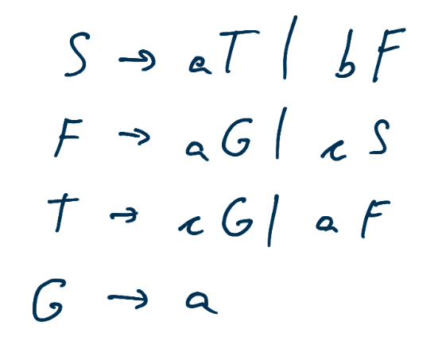

### ASD com retrocesso

-   começa pela raiz da árvore e vai até as folhas
-   visita os ramos da esquerda para a direita
-   A → **α**

#### Processo

-   expande o simbolo não terminal
-   emparelha com a entrada e verifica se a regra pode se encaixar, se
    não ele retrocede e tenta a próxima
-   tenta todas as possibilidades

#### Características

-   difícil de manter os estados para retrocesso
-   mais lento
-   mais poderoso
-   ineficiente na maioria dos casos
-   implementação complicada
-   problemas para gerenciar a tabela de símbolos
-   número de operação cresce exponencialmente
-   não permite recursão à esquerda

#### Para remover o retrocesso

-   A → xA (terminal sempre no começo)
-   deixar terminais distintos para a produção (mais fácil de
    identificar qual o próximo, baseado no caractere atual)

