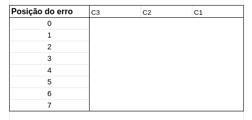
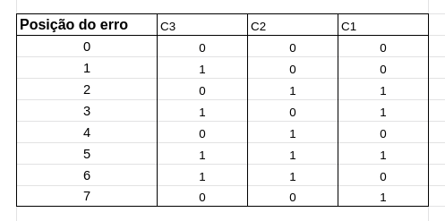
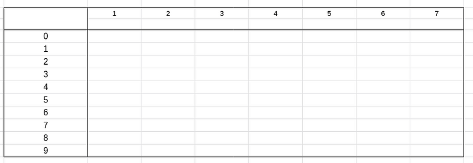
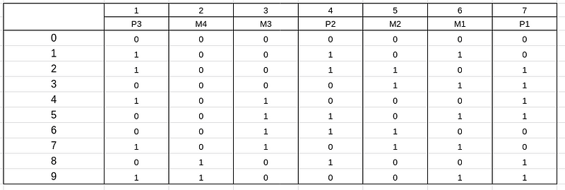
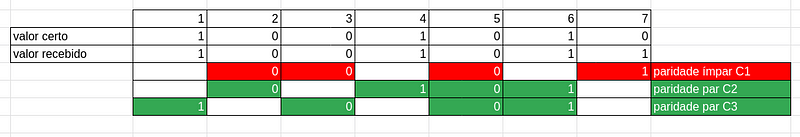

Para detectar e corrigir um erro e necessário que o código utilizado
tenha distância mínima de 3

maneiras de detectar um erro:

-   quando o código recebido não está na tabela
-   quando a paridade do código recebido é diferente da usada

**código 2 em 5**

no código 2 em 5, o valor zero é representado por 0 0 0 11, isso pois os
dois uns tem os pesos 4 e 7 respectivamente, e quando somados dão o
valor 11, por representar um número maior que 10 (que é base que esta
sendo representada pelo código) ele interpreta como 0

Um problema que apareceu na ultima aula dessa matéria foi como corrigir
um erro, o exemplo que foi apresentado recebíamos um código errado e
para saber qual era o certo era só observar qual tinha a menor distância
em relação ao recebido. No entanto, essa técnica é válida apenas para 1
erro, e em tabelas maiores a chance de ter dois ou mais dígitos com a
mesma distância é alta, então isso não funciona sempre.

para isso então começamos a utilizar os códigos de Hamming

**Códigos de Hamming**

-   utilizado para transformar códigos que não possuem a capacidade de
    detectar e corrigir erros em códigos que detectam e corrigem erros.

**1 --- Descubra a quantidade de dígitos de paridade que serão
adicionados, para isso:**

pegue o tamanho do código(m) (00011 → tamanho m de 5) e encontre o menor
numero k que satisfaça a seguinte inequação

2\^k ≥ m + k + 1

dessa forma ao encontrar o valor de k, você também saberá que o tamanho
do seu código final será m + k

> obs: você pode encontrar valores maiores para k, no entanto acaba
> ficando custoso, sendo melhor utilizar o menor k.

> obs: isso é feito para aumentar a distancia do código, deixando ele
> com no mínimo de 3

**2 --- utilize a tabela check de paridade**

para construir essa tabela você numerará as linhas de 0 até 2\^k --- 1,
e as colunas de C k, C k -1, C K --- 2, ....

exemplo com BCD

agora você deve adicionar nas linhas quais quer números de k bits, com
exceção do 0 que sempre será 0, 0, 0, ... k

agora para cada coluna C, veja as linhas que possuem 1

C1 = (2, 3, 5, 7)

C2 = (2, 4, 5, 6)

C3 = (1, 3, 5, 6)

após isso veja para cada coluna C, a linha que possui apenas um número 1

C1 = 7

C2 = 4

C3 = 1

essas serão as posições na tabela do código de Hamming

**3 --- Montando o código de Hamming**

para montar o código de Hamming você terá linhas numeradas de 0 a 9 e m+
k colunas, sendo m colunas onde você colocará os bits do código que você
está transformando e k colunas com dígitos de paridade

abaixo dos números de 1--7, você colocará mi para cada valor que não
será de paridade e pj para o valor de paridade, lembrando que a posição
da paridade dependerá daqueles números de C3, C2, C1 que vimos antes na
hora que pegamos as linhas que continham apenas 1 número 1

agora preencha os m com os valores do código

agora para preencher os P com a paridade que você escolher comparando as
linhas da do check de paridade que possuiam os números 1

lembrando que P3=C3, P2 = C2 e P1 = C1

obs: no meu caso escolhi paridade par, mas não importa muito, você pode
escolher ímpar, o que importa é você escolher uma paridade para seu
código

pronto, agora você tem um código que detecta e corrige erros

**4 --- detectando e corrigindo**

suponhamos que o código que foi enviado foi 1001010 mas o que for
recebido foi 1001011

primeiro vamos checar se há um erro, para fazer isso iremos utilizar de
novo as linhas do check de paridade que possuíam o numero 1

se todas as paridades derem a mesma que você escolheu o código recebido
está certo, mas se ao menos 1 estiver diferente o código está errado

todo C que for ímpar você troca por 1 e todo C que for par você coloca
0, dessa forma teremos 0 0 1 (respectivamente C3, C2, C1), agora pegue
esse valor e vá para a tabela check de paridade e veja qual linha tem
esse valor, o número dessa linha seja a posição que o valor está errado,
sendo assim você sabe a posição em que está o erro e para corrigi-lo
basta apenas inverter seu valor, 0 vira 1 e 1 vira 0

> obs: por isso o nome da coluna o ficam os índices das linhas no check
> de paridade chama-se posição do erro, com ela você consegue saber
> exatamente onde está o erro.

Lembrando que está tabela feita tem a capacidade de corrigir e detectar
apenas 1 erro, para mais você teria que adicionar mais valores de
paridade

