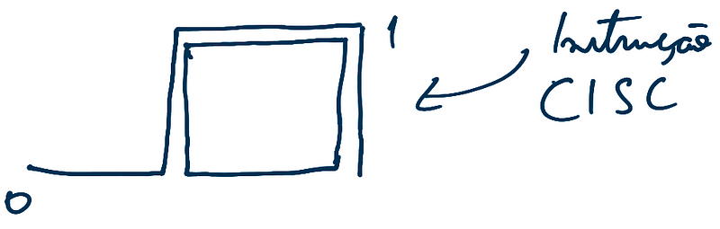

-   Hoje, Intel e AMD usam um modelo híbrido de CISC e RISC
-   A vida útil de um processador, em condições ideais, é de 10 à 15
    anos
-   3Ghz → 3 bilhões de instruções por segundo
-   multicore → particiona a tarefa em varias menores, e executa em
    ciclos diferentes juntando tudo no final

#### Unidade de controle

-   Controla as comunicações com o hardware
-   Controla onde é necessário levar uma instrução ou o que acionar
    durante uma instrução

#### Arquitetura de Von Neumann

-   base para todas as arquiteturas
-   CPU executa coisas
-   Possui sistema de E/S
-   Usa barramentos para comunicação
-   MP armazena dados e programas de forma contiguá
-   Instruções são executadas uma depois da outra
-   dentro da CPU há uma unidade de controle, os registradores e a ULA

na Arquitetura CISC, uma unica instrução, complexa, é executada em um
ciclo

já na arquitetura RISC, a instrução é quebrada em pedaços e executado em
paralelo

