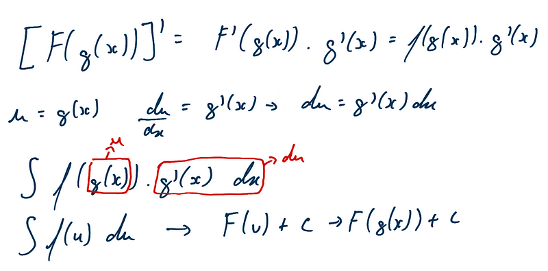

#### Método da substituição

-   realiza alguma manipulação (método de integração) na função
-   semelhante à regra da cadeia para derivadas
-   Se Temos f(x) = F'(x) e g(x) seja uma função que sua imagem esteja
    contida em F(x)

