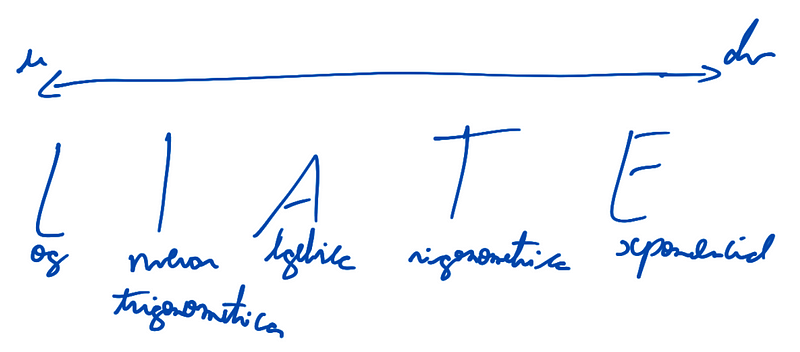

Usando essa formulação, podemos pegar integrais que não eram passiveis
de serem resolvidas usando substituição e agora resolve-las.

Contudo, precisamos entender qual parte chamar de *u* e qual de *dv*,
para isso podemos usar um artificio

usando o LIATE, podemos identificar quais tipos de função temos em uma
integral, e, com base no seu tipo, encontrar u e dv. Nesse método, *u*
sempre será o tipo de função mais a esquerda e *dv* o mais a direita.
Caso sejam do mesmo tipo, podemos escolher o que fica mais fácil de
integrar e derivar.

Com isso, é possivel seguir com a integração. Contudo, existem casos que
é necessário fazer modificações algébricas ou integrar partes usando
outras técnicas.

