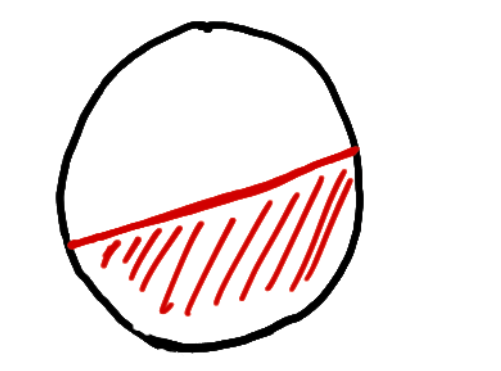
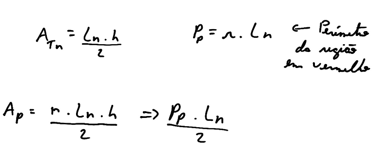

Para calcular a área da região em vermelho, poderíamos usar o método da
exaustão e um pouco de geometria.

Nesse método, dividimos a região que queremos encontrar a área em formas
geométricas menores que conseguimos encontrar seus lados, nesse caso
usaremos triângulos.

Com isso, podemos aproximar a área que queremos usando vários triângulos
menores. Assim, a área pode ser expressa como:

sendo assim, ao aumentar a quantidade de triângulos, conseguimos
aproximar ao máximo a área.

#### Definindo a integral

usando a definição acima, podemos usar para calcular a área a baixo de
uma curva em um certo intervalo de *a* à *b*.

sendo esse o mesmo resultado de *(b\*h)/2 → (3\*2)/2 = 3.*

