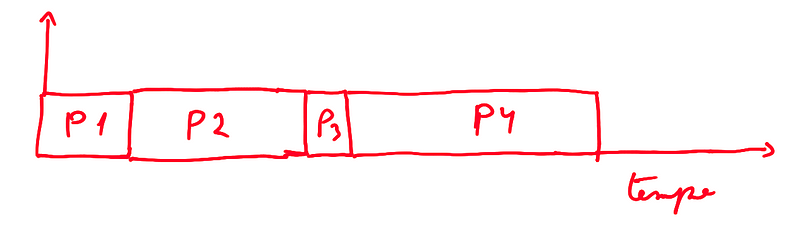
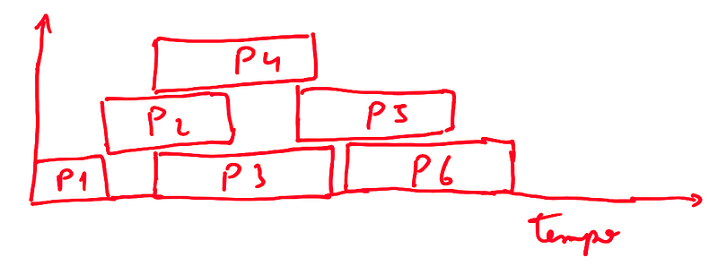

#### Pipeline

-   quebra uma instrução em partes menores que serão executadas de
    formas diferentes para ser mais rápido


#### Processos

-   programa em execução
-   e sistemas multiprocessados, você não sabe qual processo entrará
    primeiro
-   é imprevisível qual processo o escalonador escolherá para executar
-   tudo do programa fica junto de seu processo, incluindo variáveis e
    afins
-   processo sequencial → um processo é executado por vez
-   processo paralelo → varias processos são executados de uma só vez.
    Pode ser executado tudo de um programa, ou executa uma parte de cada
    por vez
-   Um programa pode ter mais de um processo, mas no mínimo 1
-   Reentrância ajuda um programa a ser paralelo
-   Para criar um processo, é feita uma chamada ao Kernel(como com o
    fork) e é criado um processo pai e filho com o mesmo endereçamento,
    depois o filho recebe um novo
-   Processos podem terminar de forma voluntaria (exit) ou
    involuntária(forçar parada, error, KILL)






#### Reentrância

-   Um processo permite que vários users (processos) sejam adicionados
    na mesma área da memória do processo pai, sem precisar carregar as
    instruções várias vezes na memória
-   variável global impede a reentrância
-   funções que não compartilham nada externamente são reentrantes (cada
    chamada da função terá o seu contexto/espaço)
-   o programa é executado várias vezes, mas só é carregado uma única
    vez na memória
-   ao executar em várias threads, um código reentrante garante
    independência

``` {code-block-mode="2" spellcheck="false" code-block-lang="javascript"}
var a = 1;
function nao_reentrante(n){
  for(let i = 0; i < n; i++){
    a += i;
  }
  return a;
}

function reentrante(n){
  let a = 1;
  for(let i = 0; i < n; i++){
    a += i;
  }
  return a;
}
```

``` {code-block-mode="2" spellcheck="false" code-block-lang="java"}
interface Func{
  public int exec(int n);
}


class Reentrant implements Func{
  public int exec(int n){
    int a = 0;
    for(int i = 0; i < n; i++)
      a += i;
    return a;
  }
}

class NonReentrant implements Func{
  private int a = 0; 

  public int exec(int n){
    for(int i = 0; i < n; i++)
      a += i;
    return a;
  }
}


class TestThread extends Thread{
  private String name;
  private Func func;
  private int n;

  public TestThread(String name, Func func, int n){
    this.name = name;
    this.func = func;
    this.n = n;
  }


  public void run(){
    System.out.println("Executing Thread: " + this.name);
    int result = this.func.exec(this.n);

    System.out.println("Result from Thread " + this.name + "= "+result);
  }
}

public class ThreadsTest{
  public static void main(String[] args) {
    //Func reentrant = new Reentrant();
    Func nonReentrant = new NonReentrant();


    //System.out.println("---Reentrant Test---");
    //Thread t1 = new TestThread("T1", reentrant, 5);
    //Thread t2 = new TestThread("T2", reentrant, 6);
    //
    //t1.start();
    //t2.start();
    
    System.out.println("---Non Reentrant Test---");
    Thread t1 = new TestThread("T1", nonReentrant, 5);
    Thread t2 = new TestThread("T2", nonReentrant, 6);

    t1.start();
    t2.start();
  }
}
```


#### Hierarquia de processos

-   Um processo pai pode dar fork e criar um novo nó na árvore
-   Windows não possui hierarquia de processos, todos são criados da
    mesma forma


#### Paralelismo

-   sistemas logicamente paralelos → em sistemas com uma única CPU,
    pequenas partes de um processo é executado de tempos em tempos de
    forma intercalada.
-   sistemas fisicamente paralelos → você possui várias CPUS então pode
    executar vários processos ao mesmo tempo usando o hardware
    disponível


#### Estados de um processo

-   Indefinido → código não está executando (é apenas um código fonte
    ainda)
-   Bloqueado → processo parado esperando um evento (I/O por exemplo)
-   Pronto para Execução → processo não está rodando, está esperando uma
    vaga na CPU
-   Em execução → utilizando a CPU

#### Transições de estados

-   Criar → Coloca o processo em memória (Indefinido para Pronto)
-   Acordar → terminou o processo de I/O (Bloqueado pra Pronto)
-   Despacho → Coloca o próximo processo a executar que está na
    fila(Pronto para Em Execução)
-   Bloquear → Esperando I/O (Em Execução para Bloqueado)
-   Preempção (Suspender) → força a comutação do processo (Em Execução
    para Pronto)
-   Destruir → Finaliza o processo (Em Execução para Indefinido)

](image_415.png)

](image_416.png)


#### Tipos de sistemas

-   estático → executa 1 aplicação
-   dinâmico → número indefinido de processos


#### Bloco de Controle de processos (BCP)

-   cada processo tem algumas informações sobre ele
-   usada para o OS administrar os processos
-   Possui → ID, estado, prioridade, ponteiros de localização (RAM,
    Disco, etc.), ponteiro para recursos, contador de programa, área de
    registros, etc.
-   É necessário salvar os dados atualizados para recuperar a cada parte
    da execução
-   Tabela de processos → tabela contento os BCPs de todos os processos


#### Escalonador

-   Controla as transições de estados dos processos
-   camada inferior do OS, acima dele ficam os processos
-   baseado em interrupções → interrupções por dispositivos externos a
    CPU → teclado, mouse ,etc.
-   ao interromper ele usa o tratador para ver o que foi que aconteceu
-   Tratador tem prioridade na fila de processos
-   interrupção do clock → fatia de temp que cada processo pode ter


