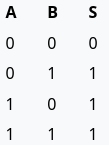
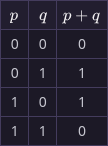

na eletrônica temos diversas portas lógicas que são derivadas de outras,
nesse caso o XOR é uma porta derivada da porta OR

assim como na vida real o ou exclusivo (ou, ou excludente) leva uma
característica excludente de sua operação. Na vida real, se dizermos ou
um ou outro, você poderia escolher apenas um dos elementos, no entanto a
porta or ela não segue esse padrão, sendo também verdadeiro quando os
dois valores forem verdadeiros, dai que vem a porta XOR, ela só será
verdadeira quando só uma das entradas forem verdadeiras.

Além disso, em suas operações, geralmente,é atribuído o operador ⊕ como
símbolo para essa porta

