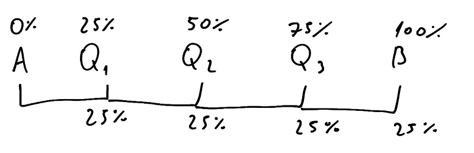

#### Medidas separatórias

-   divide a sequência ordenada em partes iguais
-   mediana também é uma medida dessas (divide em 2 parte de 50%)

#### Quartis (Q)

-   divide em 4 partes de 25% cada

#### Decis (D)

-   divide em 10 partes de 10% cada

#### Percentis (P)

-   divide em 100 partes de um 1% cada

#### Quintil (K)

-   divide em 5 partes de 20% cada

#### Relações

-   podemos relacionar cada um deles com outros
-   ex: Q1 = P25, D1 = P10, K2 = D4, etc.

#### QK, DK, PK, KK

-   essas fórmulas nos dizem qual o elemento K dentro das separações em
    dados com intervalos de classe
-   caso o dataset não esteja divido em intervalos de classe, é possível
    utilizar as técnicas ditas anteriormente e um pouco de lógica para
    encontrar tal elemento
-   formula derivada da formula da mediana para dados com intervalos de
    classe

-   agora, para saber qual posição o valor k está (dentro das classes)
    você utiliza as formulas:

