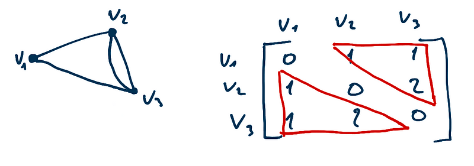
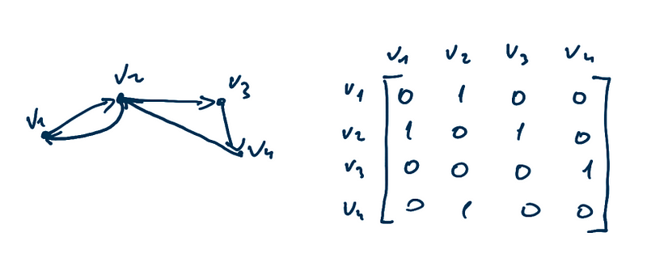

#### Matriz de adjacência

-   cada vértice é representada por um element na linha i e coluna j
-   elemento aij representa a quantidade de ligações que um vértice tem
-   cada intersecção entre linha e coluna diz se eles possuem ligações
-   Podem ocorrer espelhos na matriz, formando dois triângulos. Dessa
    forma é possível armazenar só um dos triângulos e economizar memória
-   matriz densa = poucos zeros; matriz dispersa = muitos zeros (poucas
    arestas)
-   ótimo para dígrafos e grafos densos no geral
-   no grafo não direcionado, cada elemento aij pode ser maior do que 1,
    sendo assim, cada vértice pode ter mais de uma ligação
-   no dígrafo, cada elemento vai de 0 até 1, contando a aresta que sai
    de um nó. Nesse caso é necessário manter todos os elementos. Aqui
    pode não haver os espelhos.
-   matriz booleana = diagonal principal é 0. Não há arestas
    múltiplas(loops, etc). tudo é 0 ou 1. possui os dois triângulos
    espelhados

#### Lista de adjacência

-   linked list
-   um nó base e suas ligações
-   ótimo para grafos não direcionados e grafos dispersos

