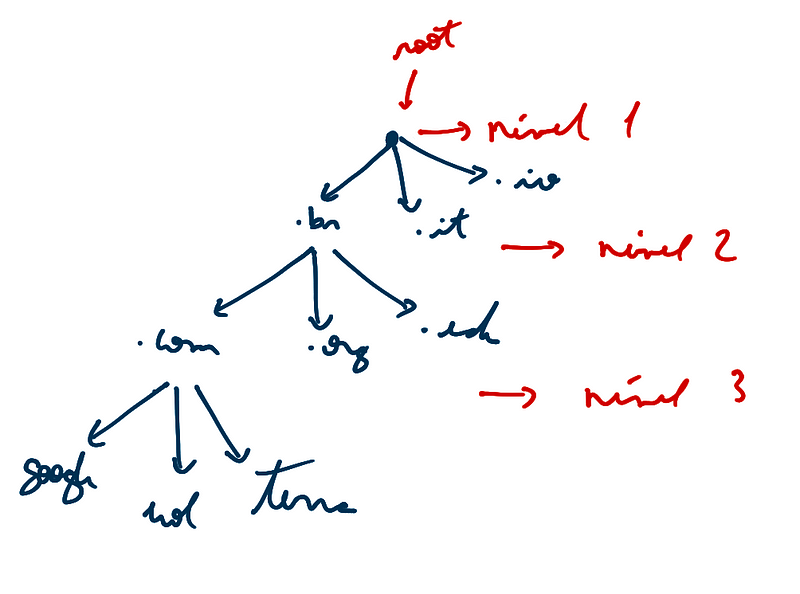

### Portas

-   tanto TCP como UDP utilizam portas para passar informações para
    camadas superiores
-   são usadas para manter diferentes conversações ao mesmo tempo
-   IANA → órgão que define portas padrão para serviços
-   FTP → 20 é para dados, 21 é para controle
-   Aplicações especificas recebem portas padrão abaixo de 1024
-   Aplicações genéricas recebem portas randômicas acima de 1023

### Domínio

-   conjunto de máquinas (hosts) que agrupam um conjunto de serviços

### DNS

-   tipo A → aponta para um IP
-   tipo CNAME → aponta para um nome
-   tipo MX → usado para email
-   tipo TXT → usado para texto puro
-   é um banco de dados distribuído
-   usa a porta 53
-   de primeiro nível (.br, .it, .io, .uk, ...)
-   de segundo nível (.edu, .gov, .com, ...)
-   para aumentar os níveis, é necessário mais de DNS para dizer quem
    vai apontar para cada domínio

](image_465.png)

-   Cada país é responsável por seu servidor que o root apontará, no
    Brasil é o registro.br que cuida de servidores .br
-   ao procurar um nome, você é redirecionado para o root, que irá
    fazendo o caminho inverso na url até encontrar o servidor em que
    está o nome requisitado
-   cada nível é um servidor
-   bind no linux é usado para configurar o DNS

### FTP

-   usado para a transferência de arquivos
-   porta 21
-   TCP

### HTTP/S

-   usado para a web
-   navegador é o cliente no modelo TCP
-   porta 80=HTTP e 443=HTTPS

### Notas

-   subdivisão de redes é denominada CIDR

