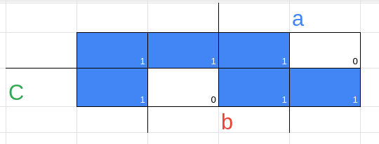
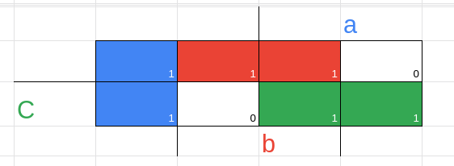
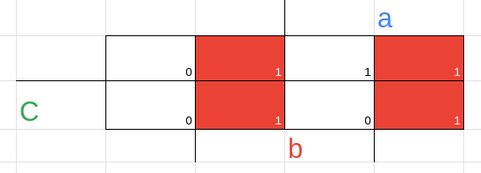
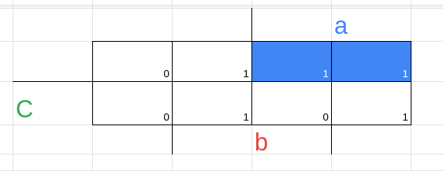
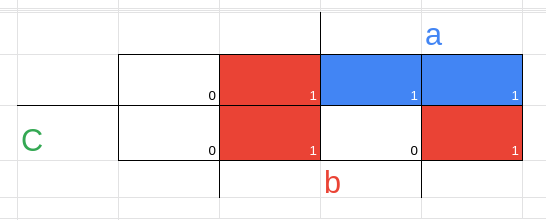

**Implicantes não essenciais**

no artigo passado sobre esse mesmo tema, dei uma breve explicação do que
serião implicantes não essenciais, mas agora vamos um pouco mais a fundo
neles

os implicantes nãos essenciais, são implicantes que todos os 1 são
cobertos por outros implicantes

**Implicantes essenciais**

o implicante essencial é aquele em que pelo uma célula pertence a apenas
esse implicante

> obs: quando falo que pertence a um implicante, lembre-se sempre de que
> pensamos em pegar os maiores implicantes possíveis, já que se fôssemos
> pegar de 1 em 1 todos serão essenciais

**como achar implicantes essenciais e não essenciais**

1 --- encontre todos os implicantes possíveis

2 --- vemos quais são essenciais e não essenciais

**Essenciais**

Nenhum

**Não essenciais**

Todos

(0, 1) = a'.b'.c → a'.b'

(1, 5) = a.b'.c → b.c'

(0,2) = a'.b.c' → a'.c'

(2,6) = a.b.c' → b.c'

(6,7) = a.b.c → a.b

(5,7) = a.b.c → a.c

3 --- Veja quais são as expressões que podemos usar para cobrir todos os
1

> obs: se tivesse algum implicante essencial ele sempre apareceria nas
> expressões (de preferência sempre no começo); Além disso, poderíamos
> ter colocado também todos os não essenciais, o resultado seria o
> mesmo, mas o circuito ficaria inviável por isso pegamos apenas aqueles
> que são de fato necessários

**Possíveis expressões úteis**

f1(a,b,c) = a'.b' + b.c' + a.c

f2(a,b,c) = b'.c + a'.c' + a.b

> obs: claramente existem vários outros possíveis resultados, mas aqui
> estamos sempre pensando em os menores circuitos, então esses
> satisfazem nosso requerimento

**Exemplo com implicante essencial junto**

temos aqui, dois implicantes essenciais em vermelho

e dois implicantes não essenciais em azul

sendo assim temos:

**Essenciais**

(2,3) = a'.b.c →a'.b

(4,5) = a.b'.c →a.b'

**Não essenciais**

(2,6) = a.b.c' →b.c'

(4,6) = a.b.c' →a.c'

agora pegaremos todos os essenciais, e os não essenciais que podem
participar para tapar todos os 1

f1(a,b,c) = a'.b + a.b' + b.c'

f2(a,b,c) = a'.b + a.b' + a.c'

**Observações**

Σ → sigma e o nome do símbolo → ele representa o somatório antes
explicado

