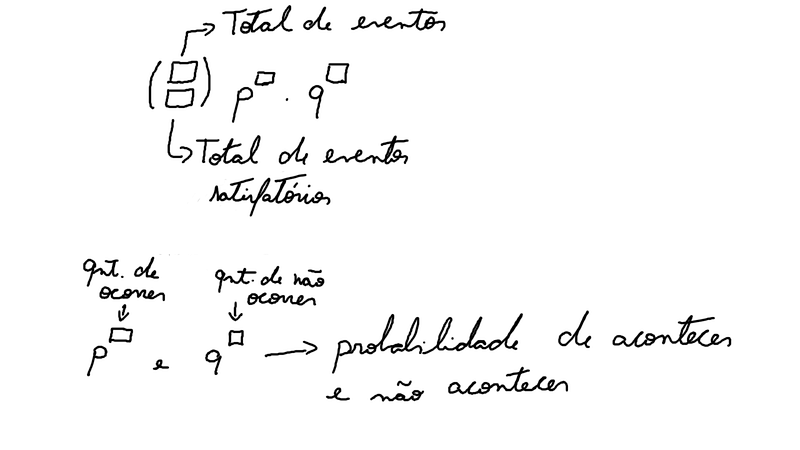
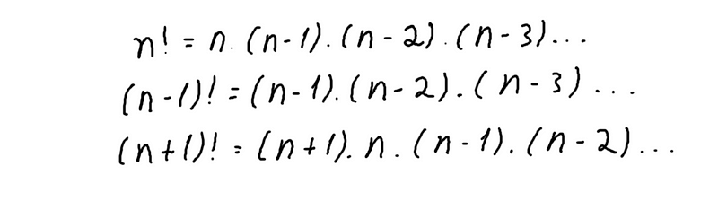

**combinação**

quando for para quebrar algo em conjuntos em que a ordem não importa, ou
seja A e B é a mesma coisa que B e A

formula → C total, conjuntos = total! / conjuntos! \*
(total --- conjuntos)!

**Arranjo sem repetição**

Arranjo é usado quando a ordem importa

A total, posições = total! / (total ---posições)!

**Arranjo com repetição**

Ar total, posições = total\^(posições)

**Molde Binômio de Newton**

**Progressão fatorial**

> obs: quando tem corta em cima e embaixo o que resta em cima é 1 e não
> 0. Além disso, quando digo qual é o valor ao quadrado que dá 81é +-9,
> agora quando digo quanto é a raiz de 81 ai é 9

