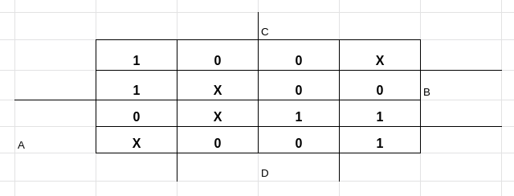
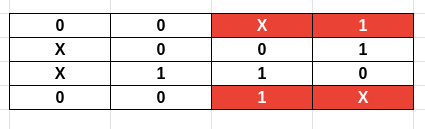

#### Na [ultima aula dessa matéria](https://dpbm.medium.com/ci%C3%AAncias-da-computa%C3%A7%C3%A3o-dia-42-1938109eeca), começamos a ver um pouco sobre mapas de Karnaugh de quatro variáveis, que de maneira geral, é a mesma coisa do que o mapa com 3 variáveis, com apenas uma região a mais.

#### No entanto, na aula seguinte, aprendemos um conceito novo, do qual se denomina, ***termo irrelevante***

**Termo irrelevante**

O termo irrelevante, é, como o nome já supõe, um termo em que seu valor
não importa, sendo assim, podemos utiliza-lo como bem entendermos,
adicionando 0 ou 1 como seu valor para deixar mais fácil nossa vida.

Geralmente, seu essa posição no mapa é representada pelo valor X, já que
o valor que será atribuído será uma incógnita que nós devemos preencher
da melhor maneira.

<figure>

<figcaption>Exemplo de mapa de Karnaugh com termos
irrelevantes</figcaption>
</figure>

No exemplo que fiz acima, estou considerando todos os X como o valor 1
mas, caso você prefira, você pode considerar 0, use sempre aquilo que
lhe fará chegar no circuito mínimo.

Agora, vamos encontrar os implicantes mas, antes disso, note uma coisa:

<figure>

<figcaption>implicante dos cantos</figcaption>
</figure>

Esses quatro cantos também são um implicante, uma vez que podemos fazer
o seguinte:

<figure>

<figcaption>implicante dos cantos sem as regiões marcadas</figcaption>
</figure>

<figure>

<figcaption>implicante dos cantos rearranjado</figcaption>
</figure>

Fazendo isso, podemos juntar as colunas que estão em cima com as de
baixo e fazer um implicante maior com quatro células.

A partir disso, podemos ver todos os implicantes que estão nesse mapa,
contudo há mais duas regras para os termos irrelevantes.

1 --- Não pode haver um implicante composto apenas por termos
irrelevantes, ou seja:

<figure>

<figcaption>implicante inválido</figcaption>
</figure>

Esse implicante acima não é válido!

2 --- Um implicante em que as células que o fariam ser um implicante
essencial (célula em que nenhum outro implicante sobrepõe) são termos
irrelevantes, o transformam em um implicante não essencial. Ou seja:

<figure>

<figcaption>implicante não essencial com um termo
irrelevante</figcaption>
</figure>

O implicante em azul, possui uma célula que não está sendo tomada por
outro implicante (o implicante vermelho pega os dois valores 1, célula 0
e 4). No entanto, o valor desta célula é X, sendo assim esse implicante
será não essencial.

Após entender essas regras, o resto é completamente igual ao que já foi
feito anteriormente, basta pegar todos os implicantes, separa-los entre
essenciais e não essenciais, fazer as expressões lógicas e pronto.

Por fim, você pode acabar encontrando expressões lógicas que lhe passam
as células que possuem valores irrelevantes como neste exemplo:

> *f(a,b,c,d) = Π(1,3,6,7,9,11,12) \* Πx(2,5,8,13)*

Nesse exemplo, estamos usando o produtório (símbolo Π ou ainda π), ou
seja, todas essas linhas terão o valor 0, mas note que há um termo
multiplicado Πx(2,5,8,13) , esse termo representa os valores
irrelevantes, sendo assim nas células 1,3,6,7,9,11,12 você colocará o
valor 0, e em 2,5,8,13 a letra X.

**Observações**

Geralmente implicantes primos possuem no máximo 2⁴ células, ou seja 16
valores, há a possibilidade de maiores, mas dificilmente será
necessário, pois o mapa se tornaria muito grande e difícil de trabalhar.

