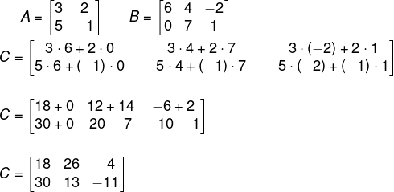

### Multiplicação Matrix x número real

-   Multiplique todos os números da matriz pelo número real.

2 \* \[1 2 3\] = \[2 4 6\]

### Multiplicação Matrix x Matrix

-   faça a soma da multiplicação de uma linha por uma coluna.

<figure>

<figcaption>brasilescola</figcaption>
</figure>

com essas duas matrizes em mãos podemos descobrir duas coisas:

1.  Se elas podem ser multiplicadas;
2.  A dimensão da matriz final.

Para descobrir se uma matrix é multiplicável por outra, basta ver se o
número de linhas de uma é igual ao de colunas da outra.

E para descobrir a dimensão final, basta pegar o número de linhas da
primeira e o de colunas da segunda. Nesse caso teremos uma matrix 2x3.

Agora basta realizar as operações. Primeiro vamos pegar a primeira linha
da primeira matrix com a primeira coluna da segunda matrix.

C11 = 3 \* 6 + 2 \* 0 = 18

C12 = 3 \* 4 + 2 \* 7 = 26

C13 = 3 \* (-2) + 2 \* 1 = -4

C21 = 5 \* 6 + (-1) \* 0 = 30

C22 = 5 \* 4 + (-1) \* 7 = 13

C23 = 5 \* (-2) + (-1) \* 1 = -11

Resultando em um matrix assim

<figure>

<figcaption>brasilescola</figcaption>
</figure>

### Matrix Inversa

Matrix inversa é aquela que quando multiplicada pela sua original
resulta em uma matrix identidade de mesma ordem.

Sendo assim:

