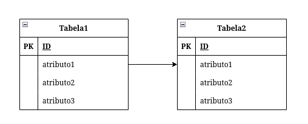

### Dicionário de dados

explicação de todos os campos da tabela, tipo de dados, limites, etc.

### Diagrama de estrutura de dados

tradução do modelo entidade-relacionamento para algo semelhante ao que
seria usado no realidade

### Regras de formação

1 --- modelo entidade-relacionamento se transforma em diagram de
estrutura de dados com os mesmo atributos

2 --- no relacionamento 1:N, o atributo determinante da entidade 1
passar para o N

3 ---no relacionamento N:M, a relação se transforma numa estrutura de
dados que possui os atributos do relacionamento mais os atributos
determinantes de cada tabela

4 ---o auto-relacionamento cria uma estrutura com dois atributos
determinantes da outra entidade

5 --- uma relação ternária cria uma estrutura com 3 atributos
determinantes das entidades

