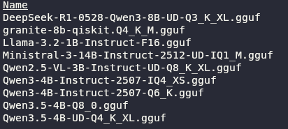
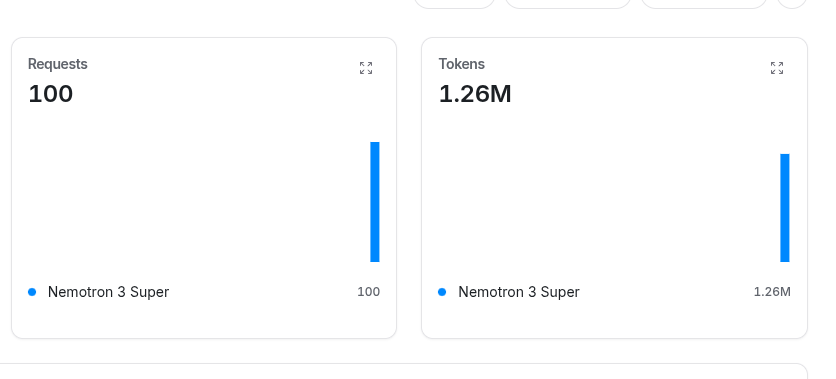
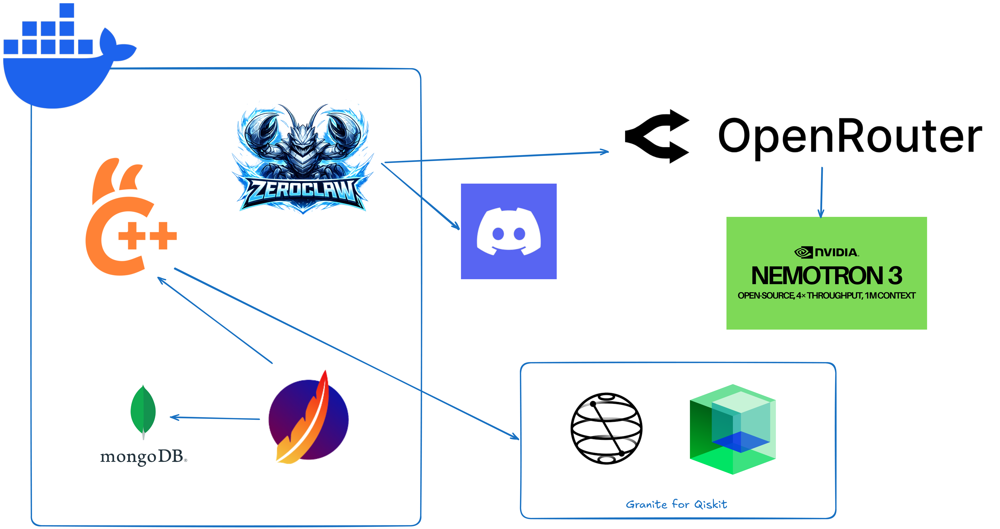

So, I suppose that at this point, everyone has heard at least a bit about agents and Openclaw.

This buzzy words came out of sudden and became the words of the decade.

As a tech guy, I'm loving all the possibilities we have with them and for sure they are great tools.

Despite of that, I had never had a grasp on creating my own agents, even though I always wanted.

However, Some days ago, I decided to change that and deploy my own agents locally. I had nothing too fancy in mind, the only thing I wanted was to setup a `Openclaw` like tool 
to send me random quantum algorithms every day on my discord server, nothing more than that.

## Searching for the model

To start my project, I started searching for models. Once I'm an unemployed master's student, I have no money to spend on a mac mini, VPS or state-of-the-art models.
So I was limited by my old `Geforce GTX 1060 6gb`. After some time searching on HuggingFace, I found a model that was perfect for me, a Granite tiny model fine-tuned for Qiskit.

I downloaded and ran it locally, it worked awesome in my setup with `llama.cpp`. I tested some prompts and everything worked. 

I configured the containers, librechat, mongo, and boom! I had a qiskit model to play with!

## Setup Zeroclaw

After that, I was wondering how would I setup my agents.

The first option would be using the `Openclaw` itself, but it was too heavy for my computer.
After a nice research, which can be seem bellow, I found some information about agents in general and local platforms to deploy them.

I found a bunch like:
* picoclaw
* nanobot
* zeroclaw
* nullclaw

At first I messed with nullclaw, but it seemed to me too much experimental and hard to setup, so I chose the zeroclaw option.

```

This research can also be found at: https://github.com/Dpbm/qiskit-personal-assistant/blob/main/research.md

## NOTES

- `SKILL.md` provide a way to create a path for allowing the openclaw to execute some commands as you need, bypassing the plan of usage.
- OpenClaw uses a channel to execute commands in your computer.
- `SOUL.md` -> defines how the agent talks with you.
- `AGENTS.md` -> what it should do before each session and how to behave.
- `USER.md` -> defines facts about you.
- `IDENTITY.md` -> defined the facts about the agent.
- `MEMORY.md` -> long term memory.
- `memory/YYYY-MM-DD.md` -> short term memory.
- you can ask the agent to modify any of these files.
- `HEARTBEAT.md` -> defines periodic tasks that are checked after some time. If nothing needs attetion, it stays quiet. Do multiple tasks in a single session, sharing context/memory.
- cron jobs -> handle recurrent tasks. Run in different sessions.

---

### CLAUDE

- Hooks -> are commands that are run when claude executes an specific action.
- Cowork -> is like claude code, but it's meant for non coders.

---

### TINY CLAW

- TinyClaw is at some level lighter than openclaw, and runs multiple agents.
- In TinyClaw, you can have teams of agents.

--- 

### RAG

- Is the hability to retrieve relevant data, interpret and augment them, and generate something with that.
- retrieving models -> models that are designed to retrieve relevant data from a knowledge base.
- generative models -> generate data based on a context.
- RAG uses a combination of both models to levarege their capabilities.
- In general, RAG is a structure that has a part that retrieves data to feed the LLM with more context.
- Vector DB stores the embeddings of your documents.
- Embedding model queries the database when needed to get more context data.
- Helps reducing unreliable sources.
- Give the model access to fresh data.
- Data outside that used for training is called external data.
- Semantic search enhances RAG results. Good for large amounts of data.
- Is more efficient than retraining the model.
- Semantic search tries to understand more deeply the intent of the user.
- Semantic search uses NLP techniques, such as: Query analysis, Knowledge graph integration, content analysis, result return and retrieval.
- Semantic search is broader than vector search.
- Can also use graph DBs and Relational DBs for some cases.
- Graph DBs can improve the responses, since it has connections between knowledge. However, they require exact query matching.
- Using both DBs can leverage the best of these technologies.
- Chunks can be fixed sized or context aware.
- Reranking -> proccess the information and sort it by relevance.

#### Types of embedding

- sparse -> great for lexical matching. Keyword relevance.
- BERT -> semantic embedding. can capture nuances. Resource intensive.
- SentenceBERT -> semantic embedding. It's the balance between deep understanding and conscise.

#### Types of Retrieval

- Naive -> get the chunck that was stored and pass it to the synthesis.
- Sentence-window -> breaks the documents in smaller chunks, like sentences, and then for synteshis it returns to the context. Search for these smaller units.

#### Types or reranking

- lexical -> based on similarity.
- semantic -> based on the understanding and relavance for that context.
- learning to rank methods -> uses a model trained for ranking documents.
- Hybrid -> lexical+semantic using feedback or other signals.


#### General Steps

1. Get external data and use embedding models to transform that data into something that fits into a vector DB.
2. Query the database.
3. Augment the user input with the data retrieved from the database.
4. pass to the LLM
5. update the database once in a while to keep it up-to-date.

They can also have a step for chunking (spliting the data into smaller significant pieces). It would fit into the first step, right after getting the external data and right before embedding it.

#### NAIVE APPROACH

- The basic implmentation.
- Responses are given without feedback or optimization.
- Get the data and feed the LLM.
- It's simple.

1. Query the database.
2. Retrieve the top relevant documents.
3. Feed the LLM.

#### ADVANCED APPROACH

- Reranking, fine-tuning and feedback loops.
- More reliable, best performance and accuracy.
- More difficult.
- Production-grade applications.

1. Query the database.
2. Retrieve the documents.
3. Rank the documents based on the context.
4. Fuses the contexts to ensure coherence.
5. The generator used for the RAG generates a response.
6. Use some techniques to retrieve the feedback (such as clicks) to improve the generation and retrieving.

#### MODULAR APPROACH

- For different use cases.
- Components can be evaluated independently.

1. A query module recieves the input (prompt) and perform some transformations to enchance it for the next steps.
2. Uses Embedding-based similarity to retrieve documents from a vector database.
3. Theses documents are filtered and ranked.
4. An LLM generate a response trying to minimize hallucinations.
5. A post-processing module is employed to ensure accuracy, fact-checking, add citations, improves readability.
6. Generate the output for the user and uses the feedback loop to improve it overtime.

---

### FIRECRAWL MCP

- Used to scrape the web for data.


## REFERENCES

- [https://www.datacamp.com/tutorial/openclaw-ollama-tutorial](https://www.datacamp.com/tutorial/openclaw-ollama-tutorial)
- [https://www.datacamp.com/tutorial/moltbot-clawdbot-tutorial](https://www.datacamp.com/tutorial/moltbot-clawdbot-tutorial)
- [https://docs.ollama.com/integrations/openclaw](https://docs.ollama.com/integrations/openclaw)
- [https://github.com/TinyAGI/tinyclaw](https://github.com/TinyAGI/tinyclaw)
- [https://www.datacamp.com/tutorial/claude-cowork-tutorial](https://www.datacamp.com/tutorial/claude-cowork-tutorial)
- [https://www.datacamp.com/tutorial/claude-code-hooks](https://www.datacamp.com/tutorial/claude-code-hooks)
- [https://openclaw.ai/](https://openclaw.ai/)
- [https://docs.openclaw.ai/](https://docs.openclaw.ai/)
- [https://github.com/sipeed/picoclaw](https://github.com/sipeed/picoclaw)
- [https://github.com/HKUDS/nanobot](https://github.com/HKUDS/nanobot)
- [https://github.com/zeroclaw-labs/zeroclaw](https://github.com/zeroclaw-labs/zeroclaw)
- [https://dev.to/brooks_wilson_36fbefbbae4/zeroclaw-a-lightweight-secure-rust-agent-runtime-redefining-openclaw-infrastructure-2cl0](https://dev.to/brooks_wilson_36fbefbbae4/zeroclaw-a-lightweight-secure-rust-agent-runtime-redefining-openclaw-infrastructure-2cl0)
- [https://zeroclawlabs.ai/](https://zeroclawlabs.ai/)
- [https://www.datacamp.com/tutorial/moltbook-how-to-get-started](https://www.datacamp.com/tutorial/moltbook-how-to-get-started)
- [https://triggo.ai/blog/o-que-e-retrieval-augmented-generation/](https://triggo.ai/blog/o-que-e-retrieval-augmented-generation/)
- [https://www.salesforce.com/br/blog/what-is-retrieval-augmented-generation/](https://www.salesforce.com/br/blog/what-is-retrieval-augmented-generation/)
- [https://cloud.google.com/use-cases/retrieval-augmented-generation](https://cloud.google.com/use-cases/retrieval-augmented-generation)
- [https://aws.amazon.com/what-is/retrieval-augmented-generation/](https://aws.amazon.com/what-is/retrieval-augmented-generation/)
- [https://azure.microsoft.com/pt-br/resources/cloud-computing-dictionary/what-is-retrieval-augmented-generation-rag](https://azure.microsoft.com/pt-br/resources/cloud-computing-dictionary/what-is-retrieval-augmented-generation-rag)
- [https://www.ibm.com/think/topics/rag-techniques](https://www.ibm.com/think/topics/rag-techniques)
- [https://cloud.google.com/discover/what-is-semantic-search](https://cloud.google.com/discover/what-is-semantic-search)
- [https://www.datacamp.com/blog/what-is-retrieval-augmented-generation-rag](https://www.datacamp.com/blog/what-is-retrieval-augmented-generation-rag)
- [https://cloud.google.com/vertex-ai](https://cloud.google.com/vertex-ai)
- [https://docs.cloud.google.com/vertex-ai/generative-ai/docs/models/evaluation-overview](https://docs.cloud.google.com/vertex-ai/generative-ai/docs/models/evaluation-overview)
- [https://github.com/firecrawl/firecrawl-mcp-server](https://github.com/firecrawl/firecrawl-mcp-server)
- [https://www.datacamp.com/blog/what-is-retrieval-augmented-generation-rag](https://www.datacamp.com/blog/what-is-retrieval-augmented-generation-rag)
- [https://towardsdatascience.com/llm-rag-creating-an-ai-powered-file-reader-assistant/](https://towardsdatascience.com/llm-rag-creating-an-ai-powered-file-reader-assistant/)
- [https://medium.com/@tejpal.abhyuday/retrieval-augmented-generation-rag-from-basics-to-advanced-a2b068fd576c](https://medium.com/@tejpal.abhyuday/retrieval-augmented-generation-rag-from-basics-to-advanced-a2b068fd576c)
```
The first thing I noticed after setting this up, was that the provided docker image wasn't working properly who knows why! So I figured how to install it efficiently on a custom container and did my setup.

```
# ---- FETCH FROM GIT -------
FROM alpine:3.23.3 AS downloader
RUN apk add --no-cache git tzdata curl
WORKDIR /repo
RUN git clone https://github.com/zeroclaw-labs/zeroclaw.git


# ---- BUILD DASHBOARD -------
FROM node:24.14.0-bullseye-slim AS web-builder
WORKDIR /app
COPY --from=downloader /repo/zeroclaw/web .

ENV CI=true
ENV NODE_OPTIONS="--max-old-space-size=2048"
ENV PATH="/app/node_modules/.bin:$PATH"
ENV ESBUILD_WORKER_THREADS=1
ENV NODE_ENV=development

RUN npm ci 
RUN tsc -b --clean 
RUN tsc -b --verbose --pretty false 
RUN vite build --mode production --debug

# ---- BUILD -------
FROM rust:1.94.0-slim-bullseye AS builder
WORKDIR /app

COPY --from=downloader /repo/zeroclaw/src src/
COPY --from=downloader /repo/zeroclaw/Cargo.toml .
COPY --from=downloader /repo/zeroclaw/Cargo.lock .

RUN sed -i 's/members = \[".", "crates\/robot-kit"\]/members = ["."]/' Cargo.toml
RUN mkdir -p ./benches && echo "fn main() {}" > benches/agent_benchmarks.rs

COPY --from=web-builder /app/dist web/dist

RUN apt update && apt install git musl-tools pkg-config -y
RUN rustup target add x86_64-unknown-linux-musl && \
    cargo build --release --target x86_64-unknown-linux-musl

# ---- FOR DEBUG -------
FROM busybox:1.37.0-musl AS tools

# ---- EXPOSE -------
FROM scratch
WORKDIR /
COPY --from=builder /app/target/x86_64-unknown-linux-musl/release/zeroclaw /bin/zeroclaw
COPY --from=tools /bin/busybox /bin/busybox
COPY --from=builder /usr/share/zoneinfo /usr/share/zoneinfo
# COPY --from=downloader /bin/git /bin/git
# COPY --from=downloader /bin/curl /bin/curl

ARG TIMEZONE=America/Sao_Paulo
ENV TZ=$TIMEZONE

ARG RECIPIENT
ENV RECIPIENT=$RECIPIENT

COPY --from=builder /etc/localtime /etc/localtime

ENV LANG=C.UTF-8
ENV HOME=/
ENV ZEROCLAW_GATEWAY_PORT=42617

RUN ["/bin/busybox", "--install", "-s", "/bin"]
ENV SHELL=/bin/sh

HEALTHCHECK --interval=60s --timeout=10s --retries=3 --start-period=10s \
    CMD ["/bin/zeroclaw", "status", "--format=exit-code"]

EXPOSE 42617

RUN /bin/zeroclaw cron add '0 9 * * *' "get a random quantum algorithm and send it to $RECIPIENT" --tz $TIMEZONE --agent

ENTRYPOINT ["/bin/zeroclaw"]
CMD ["daemon", "--config-dir", "/.zeroclaw/"]
```

At first it was hard to get the web dashboard running, but some debbuging and code analysis from their repo helped me to fix it.

Ok, so now we had our infrastructure. The remaining piece was to setup the agent. And that's the worst part!

## The agent

The zeroclaw project is meant to be a lightweight version of openclaw built with rust, which is true. But there's a major problem with it, THE DOCUMENTATION!

I wanted to setup multiple providers, create tools, new skills, etc. But there was nothing telling me how could I do it as a user. The tool which helped me the most in the particular case 
was Gemini, ok most part of the time it wasn guiding me to nowhere, but every step I took that worked was Gemini who told me what to do.

I setup everything that was remaining, and tested. It worked sometimes, but the model was not following everything I was saying. I updated the temperature sometimes, but nothing was working.

At that point, I gave up on using granite and tested a couple of different models locally.



Well, none of them worked as expected. So I remembered that Openrouter had a Free tier with some good models that you could use some amount per day, well that sounded good!

I chose nemotron, for no especial reason, and it worked. It had a better understanding than those tiny models I was using, and had a better understanding of tools, which was perfect to me.

However, the major problem now, the tokens usage. Oh boy, it eats tokens as a monster. After 3 iterations, look at how many tokens and calls it did.



Well, at that time, I was tired and decided to finish the project as it was.

The final architecture was this one:



It was simple but fun to implement.

All the code can be seen at [https://github.com/Dpbm/qiskit-personal-assistant](https://github.com/Dpbm/qiskit-personal-assistant).


## Conclusion

Even the project didn't work as expected, due to the lack of documentation, I found it a very interesting tool. While I was debugging, I tested different commands and eveyrhting was so nice.
I really don't know what, but I'm sure I'll play more with it later, this time with different flavor like `openclaw` and `picoclaw`.


