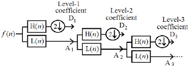

As I pursue my master's in computer science as by now a non-degree/special student, I decided to attend to two different classes this semester:

1. Algorithms (because I like it)
2. Wavelet Transforms (because it seemed interesting)

Algorithms is a pretty well know topic in computer science which you may be familiar with. Everywhere and, weird or not, every class may be related to algorithms in some way (even my wavelet class). For this semester, we learned about some ways to calculate and analyze code to find bottlenecks, performance issues, possible improvements. In general, we learned about asymptotic behavior/analysis, so `big O` notation and its relatives `θ` and `Ω`. I'd like to talk more about this, so I'll hold this topic for a future post.

## Wavelets 

Anyways, my second chosen class has algorithms involved as well, but in a different manner. The `Wavelets Transforms` class is totally related to signal processing. While I was choosing the classes it would take, it seemed the most different one for me, but after searching a bit I tought that it would help me some way in quantum computing, specially for parts related to `QFT(Quantum Fourier Transform)` or `DFT(Discrete Fourier Transform)`, even thought we don't study this tools during the course. In a high level vision, Wavelets Transforms are tools for processing a specific type of signals, called `Wavelets`. These signals can be both in time domain (when we think about audio or something like that) and space (when we think about things like images).

There are different procedures and functions for processing, but here we are focusing on `DTWT (Discrete-Time Wavelet Transform)`. This very tool is specially applied for digital signals. The idea of it is byusing a set of filters and convolutions we can apply transformations onto a signal mapping it from time/space domain to time-frequency domain. There's a lot of theory under-the-hood, that not even I could talk about since the course foccus more on applications and pretty much the basics a computer scientist would need. For those interested in the topic, I recommend checking some papers my professor [Rodrigo Capobianco Guido](https://scholar.google.com/citations?user=Jx8uPsEAAAAJ&hl=en) has published.

### DTWT/Mallat's algorithm

In general, what we need to know of it is how to calculate a DTWT out of a signal. So, there's a simple algorithm called Mallat's algorithm which states a tree like structure for processing a signal and a set of matrix based transformations for doing convolution and downsampling of the signal.

[](https://encrypted-tbn0.gstatic.com/images?q=tbn:ANd9GcRvDTsh6fqtBdNjNJv6Nu843nBe_ru30sdqxg&s)

As shown above, the algorithm starts by applying onto a signal `s` two different filters, being them a low-pass half band `h` and high-pass half band `g` respectively. At each tree level we do a downsampling on the resulting signal and further process the result of the low-pass filter until we reach a level we want or when we can't further process it.

For this purpose, there're some methods we could use, but the simplest is to generate a matrix following a similar format as below:

```

( h0 h1 0  0  ) ( s0 )
( g0 g1 0  0  ) ( s1 )
( 0  0  h0 h1 ) ( s2 )
( 0  0  g0 g1 ) ( s3 )

A matrix square that multiplies the signal.

```

The idea of this matrix is that, even numbered rows (starting from 0) contains the values of the `h` filter and odd numbered ones from `g` filter. After a pair of rows is added, the next one is pad of the left by `2^{pair_i - 1}` zeros. This way, the matrix take care of downsampling, ignoring small fluctuations and resulting a signal in the format we need. There're some nuances like when a filter is larger than the signal or the filter values go out of bounds of the matrix. For this cases we have two approaches:

1. Filter Larger than the signal

```

( h0 h1 0  0  ) ( s0 )
( g0 g1 0  0  ) ( s1 )
( 0  0  h0 h1 ) ( s0 )
( 0  0  g0 g1 ) ( s1 )

```

In this scenario, we repeat the signal bellow until the matrix and signal vector match in sizes. For this case, we might also need to pad the matrix ros on the right with zeros as well.


2. Filter goes out of bounds

```

( h0 h1 h2 h3 ) 
( g0 g1 g2 g3 ) 
( h2 h3 h0 h1 ) 
( g2 g3 g0 g1 ) 

```

Now for this case, we use a technique called `wrap around`, which consists of continue writing the signal but on the left of the row, overwriting some zeros.

After applying this matrix on the signal, we need to feel the tree nodes with the resulting elements. As one might thing, to separate those who belong to the left or the right we must take even or odd rows. The ones that were transformed by `h` filter (even rows) go to the left, while the remaining go to the right. With it, we proceed with the algorithm as we want.

We designate a DTWT level as a concatenation of every leaf in the current tree level. Each DTWT level has the same size of the original signal. 

### Inverse DTWT

To calculate the inverse, we start from the bottom of our tree and proceed by applying the transpose of those matrices on each level's node values, we must remember to put the elements in the right order, since the ones from the left go in even spots and the remaining on the odd spots.

It's straight forward to inverse a signal since these matrices, when using real wavelet filters, are orthogonal each line with any other one.

### Interesting details

There're some details I'd like to talk is that are two nuances with DTWT's. 

First one is that we could calculate the energy of each level and understand that most part of the energy is, usually, concentrated in the left side. To calculate the energy, we must sum the square of each signal value. This is interesting because it might indicate that most part of signals are low frequency or something like that.

The second one is, due to the first one, we can compress a signal by keeping the leaves that holds most part of the signal (something like 75% of the signal energy) and set zeros for the remaining. This way, when we do the inverse, we would get an approximation of what the original signal was like.

## Cuda implementation

After a bit of background on the topic, I want to discuss about my implementation in cuda.

Some day, during the class I was thinking about the possibility of doing that in cuda, since we use matrices. I'd got even more instigated to do that after my teacher said he had a procedure in C he made for teaching.

I'm little curious about cuda and GPUs in general, so I gave a chance and started doing. The final project is on my github and can be seem here: [https://github.com/Dpbm/cumallat](https://github.com/Dpbm/cumallat). In this section I want to tell some things I discovered and tips I found while working on that.


### CUDA-GDB

I always found GDB a very messy tool. I know it's powerful, but I never liked it much. There are too many specific commands you need to know, and something is difficult to find this. However, I found it very useful for cuda debugging.

Every time i heard anything about cuda, specially about debugging kernels, people were freaking out and arguing on how difficult it is to find bugs. Well, I must agree with this statement but with reservations.

Indeed, debugging cuda applications is hard, as any multithreaded application. But this is not the debugger's fault. CUDA-GDB is amazing for moving around threads and blocks in any specific moment.

For those familiar with cuda, you must know that calculating the correct index for an element in a matrix is one of the most important things, and also difficult for arbitrary setups. However, using cuda-gdb, you can easily setup a small test in c++ and check each possible index at once by changing between blocks/threads.

I will list some commands I found useful:

```bash

# to list the functions you have. It can be very poluted 
# so rememeber to set `extern "C" {}` in your code
# and also use regex after the command.
info functions  
info functions `regex`

# for changing between blocks and threads
# each positions starts at zero
cuda block (x,y,z)
cuda thread (x,y,z)

# to list information about kernels and threads
info cuda kernels
info cuda threads
```

Remember to add the flags `-g` and `-G` to the compiler before doing that.

It also worth noticing that segmentation faults may exit your debugging code sometimes and sometimes it's hard to understand at first, so if the debugger suddenly quit out of a function it may be a crash.

### Transpose matrices

While implementing the inverse DTWT, I thought about many different ways to do that. But at the end transposing in cuda is pretty much the same thing as inverting every index operation.

```cpp
// DTWT

// kernel
__global__
void dtwt(
    int signal_size,
    float* s, 
    float* h,
    float* g,
    float* m
){
    int filter_index = threadIdx.x;
    int signal_index_result = blockIdx.x;

    int shift = (blockIdx.x/2)*2;
    int signal_index_calc = (shift + threadIdx.x) % signal_size;
    
    float filter_value = signal_index_result % 2 == 0 ?
        h[filter_index]: 
        g[filter_index];
        
    atomicAdd(&m[signal_index_result], filter_value * s[signal_index_calc]);
}
// calling
dtwt<<<level_signal_size, filter_size>>>(level_signal_size, m_organized_gpu, h_gpu, g_gpu, m_gpu);


// Inverse DTWT

// kernel
__global__
void inverse_dtwt(
    int signal_size,
    float* s, 
    float* h,
    float* g,
    float* m
){
    int filter_index = blockIdx.x;

    int shift = (threadIdx.x/2)*2;
    int signal_index_result = (shift + blockIdx.x) % signal_size;
    
    int signal_index_calc = threadIdx.x;
    
    float filter_value = signal_index_calc % 2 == 0 ?
        h[filter_index]: 
        g[filter_index];
        
    atomicAdd(&m[signal_index_result], filter_value * s[signal_index_calc]);
}
// calling
inverse_dtwt<<<filter_size,complete_signal>>>(complete_signal, seq, h_gpu, g_gpu, m_gpu);

// complete_signal is pretty much the same as level_signal_size from DTWT
```

### AtomicAdd

At first, I thought that adding from multiple threads on the same position in a vector was normal and could be done with no problems. 

Oh, how Naive I was!

when we do

```cpp
a += 1
```

this is the same as 

```cpp
a = a + 1
```

and since we are running multiple threads, if the operation is done at the same time, the `a` state might change from a thread to another.

That's why we should use `AtomicAdd` in these scenarios.


### Memset

Usually, when we allocate some memory using `malloc`, we recieve a pointer to a memory position that, starting from it until the size we required, the bytes are not used anymore. And as you may have noticed, not used anymore, not necessarily null/0. So when we use an allocator, we must ensure (depending  on the usage) that the values are what we expect.  For this cases, using `Memset` and setting all positions to zero is our best ally.


### Tests

At first, I tried to use googletest, which is one of the default test suites for C++. However I found that Cuda was not supported by that, so I had to check different approaches. At the end, I did a test suite from scratch by myself. It's not the best solution for production code, but for a small experiment, it wouldn't hurt anybody.

```cpp
#include <cassert>

#include "mallat.hpp"

extern "C" {
namespace TestGenerateG{
    void TestGenerateG(){
        // ...
    }
}

namespace Organization{
    void TestOrganizeM(){
        // ...
    }
}

namespace DTWT{
    void TestDTWTHaarFilters(){
        // ..
    }

    void TestWrapAroundFilters(){
        // ... 
    }

    void TestFilterBiggerThanSignal(){
        // ...
    }


    void TestInverse(){
        // ...
    }

    void TestInverseWrapAround(){
        // ...
    }
}
}

int main() {
    TestGenerateG::TestGenerateG(); 
    Organization::TestOrganizeM();
    DTWT::TestDTWTHaarFilters();
    DTWT::TestWrapAroundFilters();
    DTWT::TestFilterBiggerThanSignal();
    DTWT::TestInverse();
    DTWT::TestInverseWrapAround();

    return 0;
}
```

I ensured to use `extern "C" {}` to make it easier to debug using cuda-gdb later.


### Building

Finally, for building the project I tested some tools, like CMAKE+CONAN, but at the end, my setup wasn't working properly. So I decided to do a humble approach by setting a simple CMakeLists file and a Makefile. Being CMake in charge for using NVCC to build and manage flags, and make to allow me to run pre set commands easily.

```cmake
cmake_minimum_required(VERSION 3.31)

project(MallatsAlgo LANGUAGES CXX CUDA)

add_compile_options(-Wno-deprecated-gpu-targets)


if(CMAKE_BUILD_TYPE STREQUAL "Debug")
    message("----- Using DEBUG version -----")
    add_compile_options(-g -G)
    add_executable(mallat_tests)
    target_sources(mallat_tests PRIVATE tests.cu)
endif()

add_executable(mallat)
target_sources(mallat PRIVATE example.cu)
```

```make
TARGET=./build/mallat
TARGET_TESTS=./build/mallat_tests
SOURCE=example.cu
TEST=tests.cu

all: $(TARGET)

$(TARGET): $(SOURCE)
	cmake -B build -DCMAKE_CUDA_ARCHITECTURES=native
	cmake --build build
	$(TARGET)

debug: $(SOURCE) $(TEST)
	cmake -B build -DCMAKE_BUILD_TYPE=Debug -DCMAKE_CUDA_ARCHITECTURES=native
	cmake --build build 
	$(TARGET_TESTS)
```

With this project, I found that the minimal setup is the best. The more over-engineering you do, the less the chance of you finishing your project.


