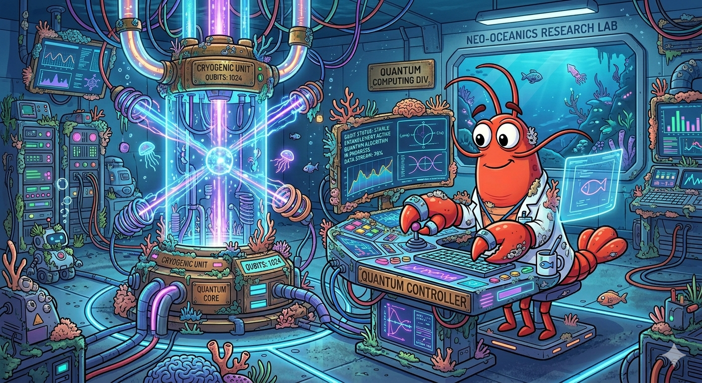
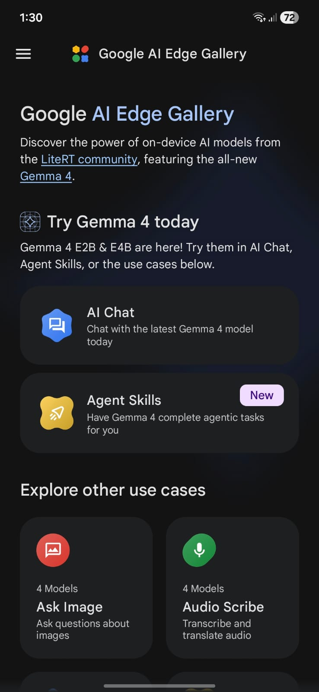
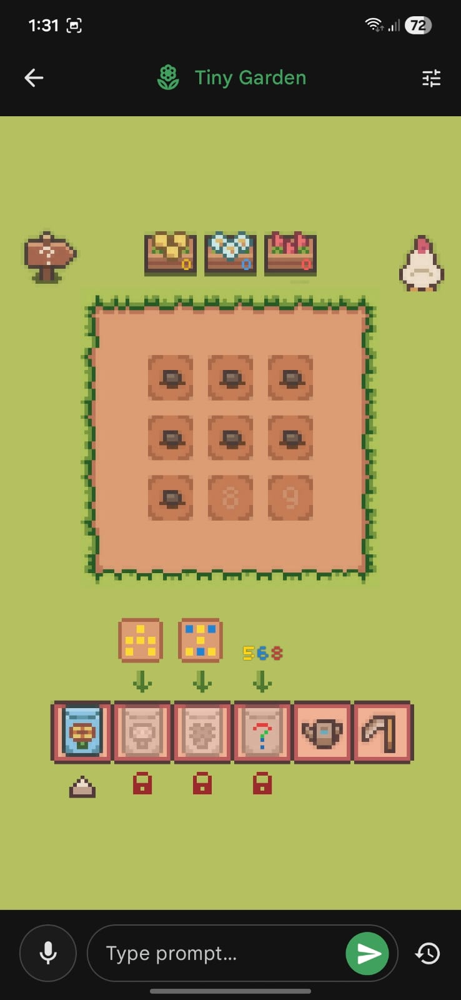
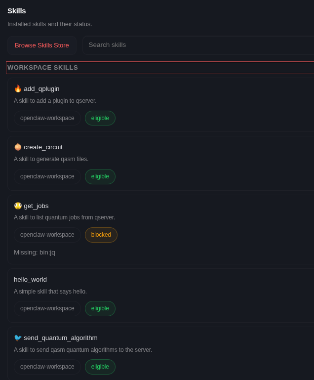
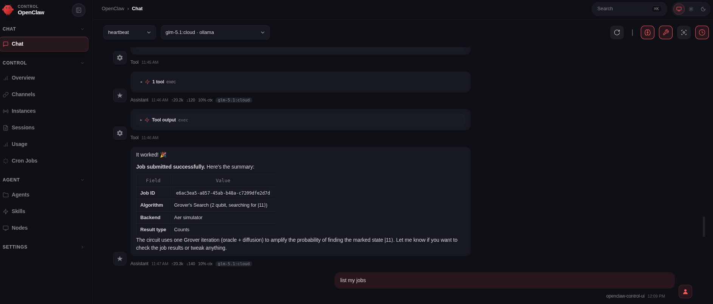
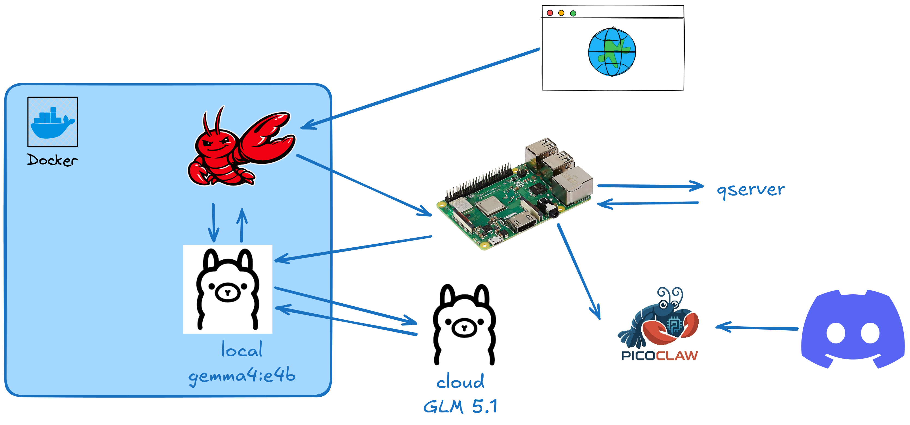

Since I did my zeroclaw setup (post: [how-i-failed-on-creating-my-own-ai-agent-rxdcmfxqpempm](https://personal-website-phi-seven-36.vercel.app/posts/how-i-failed-on-creating-my-own-ai-agent-rxdcmfxqpempm/)) I was playing around a bit with LLMs in general. 

I've been using a lot of `ChatGPT`, `Gemini` and `Perplexity` for studying and clarification in some topics. I also tested the new `Muse Spark` model from `Meta AI` and `Github Copilot` with Claude Haiku. Vibe coding is something that I always abominate, but after testing I found it very useful for prototyping and doing frontend applications fast, for that I installed `Antigravity` (take a look at the interface of my app: [fngames](https://github.com/Dpbm/fngames)). Even reported some exposed OpenAI API Keys for some companies.

Additionally, I setup `Openclaw` in a docker container (for security reasons), but it went any further at that moment. The reason was the model, I had no idea which one to use. I had no money to use better models like `Claude 4.6` or `GPT 5.4`, neither a good GPU for running `Qwen` or `Kimi` locally. I thought about using `OpenRouter` free plan, but my previous experience taught me that these agents ate tokens like monsters, so my limits would run out really fast.

Some time had passed, and I dind't touch the project anymore. I was urging for some solution, but none was found, until ... Two lights at the end of the tunnel appeard almost at the same time.

## The birth of Gemma 4

First, Google released `Gemma4`, an open model which uses a new compression of KV Cache that make it so memory efficient that can run perfectly on a smartphone. Google even has released the preview of it edge gallery app on play store and appstore, which was previously only available on github ([https://github.com/google-ai-edge/gallery](https://github.com/google-ai-edge/gallery)) via a release apk.

I installed on my cellphone e played around with it for a while. I was amazed with tiny but instersting features they added like the tiny garden.




I played that a lot, even tried to find prompt injection on it.

For chating, I selected the `Gemma4:e2b` which was the smallest one, but really good, so I thought: 

> Maybe I can run that on my PC.

Even with an old pc, with a GTX 1060 6Gb, I setup ollama and tested gemma, and wow, it worked, pretty well by the way!

At that moment, a new hope was established for my ollama project.

I create a docker compose to orchestrate everything, and run that:

```yml
services:
  openclaw:
    image: ghcr.io/openclaw/openclaw:latest
    container_name: openclaw
    hostname: claw
    volumes:
      - "./claw:/home/node/.openclaw"
      - "./shared:/home/node/shared"
      - "./bins:/home/node/bins:ro"
    ports:
      - "18789:18789"
    environment:
      - OPENCLAW_TOKEN="${OPENCLAW_TOKEN}"
      - SERVER_URL=http://192.168.0.4:8080
      - PATH=/usr/local/sbin:/usr/local/bin:/usr/sbin:/usr/bin:/sbin:/bin:/home/node/bins
    user: "1000:1000"
    healthcheck:
      test:
        [
          "CMD",
          "node",
          "-e",
          "fetch('http://127.0.0.1:18789/healthz').then((r)=>process.exit(r.ok?0:1)).catch(()=>process.exit(1))",
        ]
      interval: 30s
      timeout: 5s
      retries: 5
      start_period: 20s
    command: openclaw gateway
  

  ollama:
    image: ollama/ollama
    container_name: ollama
    hostname: ollama
    volumes:
      - "ollama:/root/.ollama"
    ports:
      - "11434:11434"
    environment:
      - OLLAMA_HOST=0.0.0.0
    restart: unless-stopped
    deploy:
      resources:
        reservations:
          devices:
            - driver: nvidia
              count: all          # Or a specific number like '1'
              capabilities: [gpu]

volumes:
  ollama:
    external: false
```

I used the openclaw builtin chat, setup some skills, but for some reason the Gemma4 was not good enough for tool calling. I tested a bigger one `gemma4:e4b`, but it did no better.

Looking at the list of models from Ollama's website, none of those would fit on my computer, except `granite` but something happened before I even tested it ...


## The Miracle of Ollama Cloud

In that day, a friend of mine send me a whatsapp message telling me his new aquisition. He had just paid for Claude's pro version, he was aiming to have an AI programming partner for his new project.

His project was a system for a company nearby he was working for as a freelancer. While the agent was creating the platform via `antigravity`, he shown me a whatsapp bot he built with `minimax m2.7`. I was amazed with his achivement, it was really good, he had feed the model with the company's data, so it knew everything it could ask for, and everything they had for selling. I remember he said:

> It's probably not running on my machine, it's runnig so smoothly

I wondered, is he using Ollama Cloud, but for free????

So I asked him if he had configured something for cloud, and he say `Yes`. So I went directly to Ollama's website, and pulled the minimax model locally. The download was really fast, so I ran the model and it asked me to login. I created an account and boom! I had a state-of-the-art model running on the cloud for free.

So, I knew exactly what I needed to do.

In filtered the models which were good for tooling and, obviously, run on the cloud. My final options were:

* minimax-m2.7
* glm-5.1
* kimi-k2.5
* gemini-3-flash-preview

But the one I chose was `GLM-5.1`.

## Skills

At first I was trying to fix my skills because they were not working, but later I found that the problem was the model (maybe my skills were bad as well). I tried fixing it with some help from `Gemini` and `GPT`, but only changing the model was the solution for me.

In my local network, I had a Raspberry Pi 3b+ running my [qserver](https://github.com/Dpbm/qserver) at port `8080`. My idea was that the model could access it via `curl` and `grpcurl` (once it uses GRPC too).

For simplicity, I designed 4 skills:

1. Generate circuit in qasm files (give the description too).
```md
---
name: create_circuit
description: A skill to generate qasm files.
metadata:
  {
    "openclaw":
      {
        "emoji": "🧅",
      },
  }
---

# Create Circuit Skill

When the user asks to create a quantum circuit. First, you'll generate the circuit in the `openqasm` format and save it at `/home/node/shared/{{ circuit_name }}-$(date --date="now").qasm`, for it you must use the Exec and Write tools.

Then, you will output for the user in the following format:

# {{ circuit_name }} Algorithm

---

Who created it: { add the main authors of this algorithm here }
Papers: { Papers which explain it }

---

{ explain the algorithm itself here }

---

{ show the qasm code here }


```

2. Send the circuit (simulate).

```md
---
name: send_quantum_algorithm
description: A skill to send qasm quantum algorithms to the server.
metadata:
  {
    "openclaw":
      {
        "emoji": "🐦",
        "requires": { "bins": ["grpcurl"] },
      },
  }
---

# Send Quantum Algorithm Skill

When the user asks to run or send a quantum circuit, execute the following commands:

export DATA="$(cat <<EOM
{"properties":{"resultTypeCounts":{ if the user asks for counts add true here }, "resultTypeQuasiDist":{ if the user asks for quasi dists add true here }, "resultTypeExpVal":{ if the user asks for expectation values add true here }, "targetSimulator":"{ the user desired backend }", "metadata":"{ {the desired metadata in json format} }"}} 
{"qasmChunk":"{ add the qasm data here }"}
EOM)
"
grpcurl -plaintext -d '$(echo $DATA)' "$(echo $SERVER_URL)" Jobs/AddJob

The user must provide you the following data:

* counts: this tells you if you must retrieve the counts from the simulation (default:false)
* quasi-dist: this tells you if you must retrieve the quasi distribution from the simulation (default:true)
* expval: this tells you if you must retrieve the expectation value from the simulation. When using this the user must provide a metadata containg the observables and coeffients (default:false)
* metadata (optional): this adds additional information for your experiment in the json format (default:{})
* backend: The simulator to be used for that.
* qasm: the data to be sent.


After running the commands you must show the user the output job ID.
```

3. Get jobs.

```md
---
name: get_jobs
description: A skill to list quantum jobs from qserver.
metadata:
  {
    "openclaw":
      {
        "emoji": "🫪",
        "requires": { "bins": ["curl", "jq"] },
      },
  }
---

# Get Jobs Skill

When the user asks to list his jobs, Execute the following command:
`curl "$(echo $SERVER_URL)/api/v1/jobs" | jq`

Show him the output of the command.
```

4. Add Qplugin.

```md
---
name: add_qplugin
description: A skill to add a plugin to qserver.
metadata:
  {
    "openclaw":
      {
        "emoji": "🔥",
        "requires": { "bins": ["curl"] },
      },
  }

---

# Add QPlugin Skill

When the user asks to add a plugin, Execute the following command:
`curl -X POST "$(echo $SERVER_URL)/api/v1/plugin/{{ plugin_name }}"`
```

After that, I used the chat from openclaw again and tested each part, which was a success!





## Picoclaw

To finish my experimentation, I decided to test picoclaw on my raspberry pi too! The motivation for that came after watching the video from [playduino](https://www.youtube.com/@playduino) of which he Installed
openclaw on an Arduino Uno Q, I found that very interesting and decided to test a little bit myself.

[](https://www.youtube.com/watch?v=-x7U5ClLyH4)

Even though I was using an IOT device, I did nothing too fancy. My idea with picoclaw was to have a discord channel to chat with it and only that.

I setup an ansible playbook to automate the proccess, installed the picoclaw and uploaded my configuration to the device via ssh.

For this one, I used the ollama server from my computer that was exposing `gemma4:e4b`. 

Then entered on discord and chat with the model a bit, but again, nothing to fancy, only some chat and qunatum computing stuff.

I was really tired at that moment, so I didn't test it too much. But if you want a setup like mine, check the repo here: [https://github.com/Dpbm/openclaw-setup](https://github.com/Dpbm/openclaw-setup).

## Final Setup

The final setup followed this structure:



My computer was being used as a more powerfull server for LLMs and the raspberry as a intermediate server with some power for simple quantum circuits via qserver.

It's not too advanced, but the main idea was to experiment stuff and not to do production ready systems.
