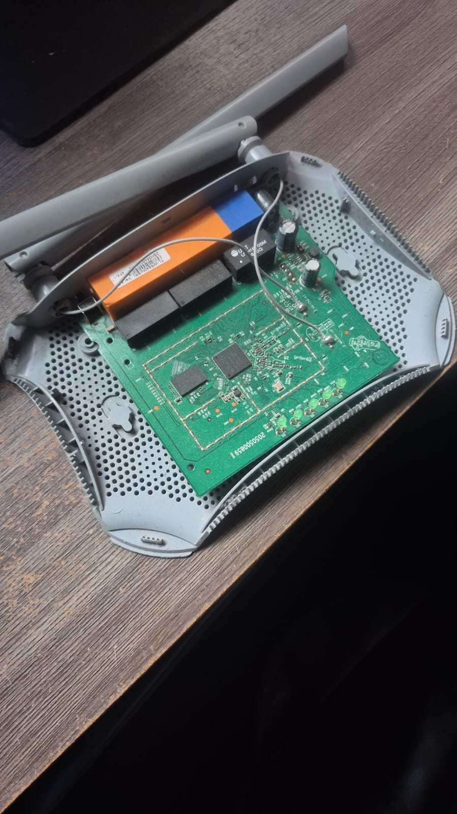
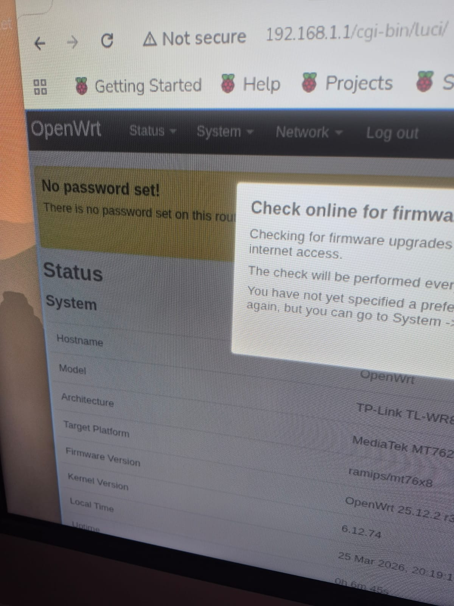

I've been working in some projects and for a specific problem I needed to have more control in my network.

I need to setup more advanced stuff, like more specific routing rules, etc.

I could have done that on my router, but it could affect the usage for my family. So, thank god, I've got some old TP-Link routers as a gift from a friend, who was trying to get rid of this "junk".

When I saw them I decided to try and install OpenWRT.

I've never used it before, but I had heard so many cool stuff about it, so I couldn't help giving a try.

The model I was using was a `TP-Link TL-WR840N v4 - BR` and the official guide to install it is available at: [https://openwrt.org/toh/tp-link/tl-wr840n_v4](https://openwrt.org/toh/tp-link/tl-wr840n_v4).

To install I had to setup a `TFTP` server and set the machine to ip `192.168.0.66`, then connect wired the computer and the router through any LAN port, hold the reset button and then power-on the router.

For that, I did a small setup with my Raspberry-pi 3b+. I installed the package `ftfpd-hpa`, setup the server as disclosed in [https://www.howtoraspberry.com/2022/03/how-to-build-a-tftp-server-on-a-raspberry-pi/](https://www.howtoraspberry.com/2022/03/how-to-build-a-tftp-server-on-a-raspberry-pi/). Then followed the installation guide from the openwrt page, and flashed the firmware and update.

At first, I was kinda scary because the page: `192.168.1.1` was not working, I thought that maybe the setup didn't work or whatever. Thank good I had forgot to change my ip back to DHCP and now after executing `ping 192.168.1.1` the ping was reaching the host, after the update the web page was running correctly. Thank god!

I'm not a network guy, but I enjoy testing stuff, it will help me so much on my Hacking stuff.
