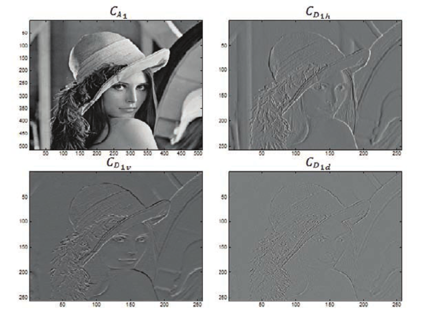
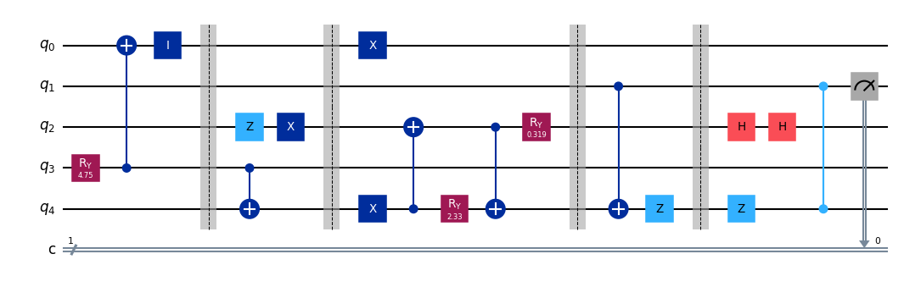
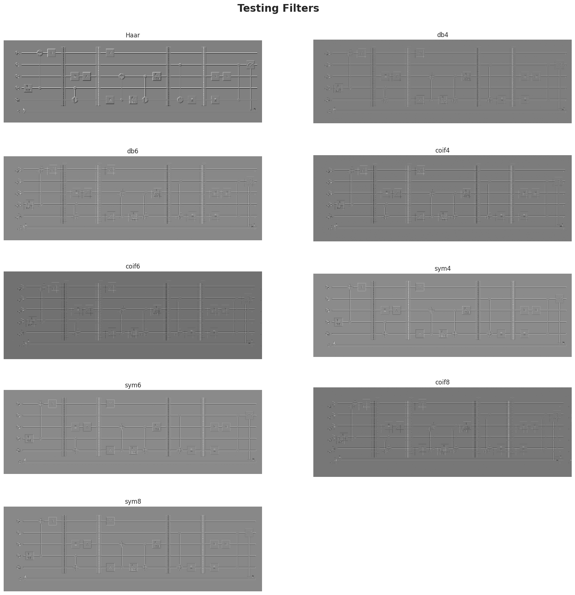
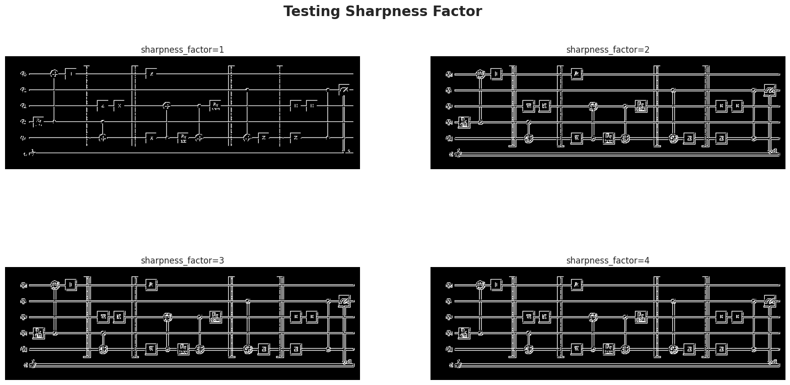

Well, my course on Wavelets transform is reaching the end, which is pretty sad. When I was choosing the subjects to study this semester, this one was the strangest to me, I had never heard of such a topic like that, actually I had heard of DSP for trading and whatever, but never had a formal knowledge on that. Now, that I have a more solid foundation on the topic, I can say that I have no regrets on choosing it. It's so interesting in so many ways.

Even though the course is focused on applications of wavelets, it's a powerful source of insights.

For those who don't follow me on Github, I've been for a while building an AI to predict the probability distribution of a quantum circuit given its image. I named it QCOP, which stands for "Quantum circuit output prediction", which is available here: [https://github.com/Dpbm/qcop](https://github.com/Dpbm/qcop).

At first, my idea was to create a simple neural net in a few days ala GeoHot. However, it's been amount a year and I haven't finished yet. Primarily because I haven't gave too much attention for it, and did a lot of side projects on top of it, and the second reason was that I haven't used the right tools.

The basic previous idea was to generate random circuits apply `ResNet` on that, train and then try to predict a simple GHZ. However, I kinda overengineered at first and didn't tought about two major points:

- imbalanced dataset
- wrong image processing procedure

Since the dataset was being generated inhouse, with no outside bias, I tought that maybe it was clean. However, my code was not taking into account a bunch of factors that could imbalance the data. As I started analysing it, I came a cross a bunch of data data could be removed. So, I'm in progress to clean this data and continue with the model (which I'll probably change as well).

For the second point, image processing pipeline was something like: 

```python
def _transform_image(img:Image) -> torch.Tensor:
        """
        Transform and normalize a PIL image into a torch tensor ranging values from 0 to 1.
        """

        img = img.convert("RGB")
        pipeline = [
            v2.Grayscale(),
            v2.PILToTensor(),
            v2.RandomAutocontrast(p=1),
            v2.RandomAdjustSharpness(sharpness_factor=4, p=1),
            v2.ToDtype(torch.float16, scale=True),
        ]
        return v2.Compose(pipeline)(img) / 255.0
```

Which is not so bad, but could be better.

---

After my last class on wavelets, we learned about 2D-DWT. This is one is basically the same procedure we saw in the previous post: [https://personal-website-phi-seven-36.vercel.app/posts/mallats-algorithm-with-cuda-everything-ive-learned-with-it-me7jmibwm2xof/](mallats-algorithm-with-cuda-everything-ive-learned-with-it-me7jmibwm2xof/), but in 2D.

This one is even simpler if we think of it as basically matrix multiplication. 


The overall calculation can be done as: $Y[\cdot][\cdot] = m[\cdot][\cdot](s[\cdot][\cdot] * m[\cdot][\cdot]^{T}$, where $m$ is the filter matrix as we have done in DTWT, $s$ is the signal and $Y$ the resulting matrix. To finally get the processed image, we need to rearrange the elements in the $Y[\cdot][\cdot]$ matrix, such that the first quadrant has all values from `even rows and even columns`, the second from `even rows odd columns`, the third from `odd rows even columns` and the last one from `odd rows and odd columns`.

The most interesting part, is that each quadrant represent a thing. So the first one is the image with less noise and reduced in size, the second and third are borders and the last one the noise itself.

[](https://www.researchgate.net/publication/221909969/figure/fig3/AS:305307361267718@1449802355881/level-discrete-wavelet-transform-of-Lena-image-using-figure-2-filter-bank.png)

As I saw that, my mind blowed at that same moment. I had a great idea to introduce that into my QCOP project, and that's exactly what I'm doing. 

I got the following image for testing: 



I tried many different filters as can bee seen bellow. Everthing was done with help of [PyWavelets](https://pywavelets.readthedocs.io/) which is a really handy library for wavelets, I'm also urging to use [Wavelets.jl](https://github.com/JuliaDSP/Wavelets.jl), but that's for a future project.



As my "eye criteria" shown, the `Haar` filter is the best one. I assume that, for being so simple, the abrupt change in the coeffients was the reason for it to be so good at finding borders.

I tested some combinations of other filters and stuff. My tests pointed that using the Haar filter with wavelets transform and then applying a Sharpness filter, it could:

1. reduce the dimensions of the image (since the 2D-DWT first quadrant is $1/4$ of the whole image)
2. enhance the borders
3. reduce noise
4. reduce the amount of information (since we only need to see the borders and nothing else)



So the final pipeline I'm planning to implement is the following:

```
image --> 2D-DWT level 1 --> sum quadrants 2 and 3 --> enhance sharpness --> binarize (reduce the memory footprint - uint8)
```

I'm not sure if it's the best, but I've been reading some papers, and it seems to be a good idea!

Keep in touch with my github to see the next chapters of this crazy project! [https://github.com/Dpbm/qcop](https://github.com/Dpbm/qcop)

## Papers I'm reading:

- [Image retrieval based on effective feature extraction and diffusion process](https://link.springer.com/article/10.1007/s11042-018-6192-1)
- [Evaluation of feature extraction methods for different types of images](https://link.springer.com/article/10.1007/s12596-022-01024-6)
- [A Review on Image Feature Extraction and Representation Techniques](https://gvpress.com/journals/IJMUE/vol8_no4/39.pdf)
- [A review of image features extraction techniques and their applications in image forensic](https://link.springer.com/article/10.1007/s11042-023-17950-x)


## I recommend for wavelets:

- [Effectively Interpreting Discrete Wavelet Transformed Signals [Lecture Notes]](https://repositorio.unesp.br/server/api/core/bitstreams/730b4a0f-a61b-4e2b-b3cb-10a3cd30f8e9/content)
- [Ripples in Mathematics](https://link.springer.com/book/10.1007/978-3-642-56702-5)


